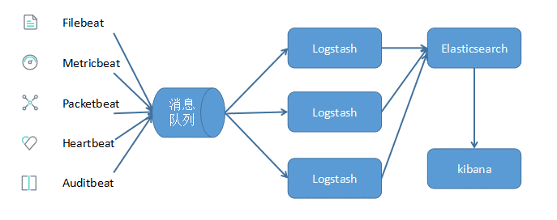

## 简介

[ELK Stack](https://www.elastic.co/guide/index.html) 是以 [Elasticsearch](https://www.elastic.co/guide/en/elasticsearch/reference/current/index.html), [Logstash](https://www.elastic.co/guide/en/logstash/current/index.html), [Kibana](https://www.elastic.co/guide/en/kibana/current/index.html) 三个开源软件为主的数据处理工具链,是目前比较流行的开源实时日志数据分析解决方案.随着技术的演进,Logstash 由于其量级过重而被逐渐被人们替换为更轻量的 [Beats](https://www.elastic.co/guide/en/beats/libbeat/current/beats-reference.html) 或 [Fluentd](https://www.fluentd.org/). ELK Stack 也逐渐演变为 EFK Stack.

在 ELK/EFK 栈中,

- Elasticsearch 是整个技术栈的核心,主要负责将数据转化为内部的数据以指定的方式保存起来,它提供了对其中数据增删查改的 API 使用户可以对数据进行操作
- Logstash 负责数据的收集,过滤处理和格式化.它提供了多种 `input`, `filter` 和 `output` 插件分别对数据进行输入,分析过滤及输出.它多用于对数据进行过滤或格式化处理.
- Beats 主要负责数据的收集,它提供了多种数据的输入类型,包括日志数据,指标数据,网络数据,审计数据,心跳数据等.它多用于将数据收集汇总后,输出到消息队列或 Logstash 中.
- Fluentd 与 Logstash 类似,负责数据的收集,处理和过滤.它提供了多种插件对数据进行输入,过滤,路由或输出.它多用于对数据进行过滤或格式化处理.
- Kibana 主要对 Elasticsearch 中数据的统计展示和可视化,它提供了 UI 界面,并将用户在界面上的操作转化为 Elasticsearch API 的请求,查询后再显示在 UI 界面中.

## 常见架构

### 最简单架构

Logstash 通过输入插件从多种数据源获取数据,经过过滤插件对数据进行筛选,格式化,然后通过输出插件输出到 Elasticsearch 中,通过 Kibana 展示.


这种架构十分简单,使用场景也有限.初学者可以通过此架构了解 ELK 如何工作

### 多个 LogStash 用于数据收集


这种架构需要在各个服务器上部署 Logstash,而 Logstash 比较重量级,服务器性能会有所下降,甚至可能导致应用无法正常工作

### Beats 作为日志收集器

Beats 将搜集到的数据发送到 Logstash,经 Logstash 解析,过滤后，将其发送到 Elasticsearch 存储,并由 Kibana 呈现给用户.


这种方式解决了 Logstash 在各个服务器上占用系统资源过高的情况,相比于 Logstash,Beats 更加轻量,系统资源占用也比较低.且支持 SSL 加密传输,保证通信安全

### 引入消息队列机制

无论是 Beat 还是 Logstash 均支持消息队列的输入输出,目前支持 Kafka,Redis,RabbitMQ 等常见消息队列.可以由 Beats 收集数据后,通过消息队列输出插件将数据写入到消息队列中,然后 Logstash 通过消息队列输入插件从消息队列中读取数据进行处理后传入到 Elasticsearch 存储,并由 Kibana 呈现给用户.



当数据量较大时,可在合适的位置添加消息队列,减少 Logstash 的负荷.引入消息队列,可以降低由于数据量过大而导致某些组件的性能瓶颈,降低了数据丢失的可能性.同时,Elasticsearch 可以做成集群模式或增加节点数量,以便增加其性能.

## 部署 Elasticsearch

### 下载并解压安装包

```bash
wget https://artifacts.elastic.co/downloads/elasticsearch/elasticsearch-7.7.0-linux-x86_64.tar.gz
tar -xzf elasticsearch-7.7.0-linux-x86_64.tar.gz
cd elasticsearch-7.7.0/
```

### 必须的系统配置

- 禁用 `swap`.可在 `/etc/fstab` 种永久关闭
- 设置文件描述符至少为 65535.可在 `/etc/security/limits.conf` 设置`nofile` 的值
- 设置线程数量至少为 4096.可在 `/etc/security/limits.conf` 设置 `nproc` 的值
- 设置虚拟内存至少为 262144.可在 `/etc/sysctl.conf` 中永久设置

```bash
swapoff -a
ulimit -n 65535
ulimit -u 4096
sysctl -w vm.max_map_count=262144
```

### 重要的 Elasticsearch 配置

Elasticsearch 的配置文件在 `config` 目录下,其中

- `elasticsearch.yml` 包含 Elasticsearch 配置信息
- `jvm.options` 包含 Elasticsearch JVM 配置信息
- `log4j2.properties` 包含 Elasticsearch 日志信息

下面列出了 `elasticsearch.yml` 中一些重要的 Elasticsearch 配置

```yml
cluster.name: elasticsearch # 集群名称,默认为 elasticsearch
node.name: ${HOSTNAME} # elasticsearch 节点名称,默认为节点主机名
path.data: ["/es-data1", "es-data2"] # 数据目录,默认为解压目录中的 data 目录,可以指定多个,相同分片会保存到统一目录下
path.logs: /var/log/elasticsearch # 日志目录,,默认为解压目录中的 logs 目录
network.host: "0.0.0.0"  # elasticsearch 监听地址,默认为 127.0.0.1
http.port: 9200 # 监听端口
discovery.send_hosts: ["vm1:9300", "vm2:9300", "vm3:9300"] # 广播发现集群的地址列表,默认在 9300 端口进行广播通信
cluster.initial_master_nodes: ["vm1:9200", "vm2:9200", "vm3:9200"] # 集群主节点列表,首次启动时生效
xpack.security.enabled: false # 是否启用 xpack-security 安全认证插件
```

下面列出了 `jvm.options` 中一些重要的 Elasticsearch JVM 配置

```text
-Xms1g
-Xmx1g
```

默认情况下,Elasticsearch JVM 设置为使用 1G 的堆内存.但是在生产环境中,需要遵循如下配置:

- 设置两个配置参数相等
- 将 `Xmx` 和 `Xms` 设置为不超过物理内存的 `50%`
- 一般来说,配置参数越大,性能越好,但不超过 32G

### 启动 Elasticsearch

```bash
# 后台启动
bin/elasticsearch -d

# 指定启动过程中的参数
-E <KeyValuePair>
# -Epath.data=data -Epath.logs=log
```

可通过 `curl http://localhost:9200` 查看 Elasticsearch 的启动信息

## 部署 Kibana

```bash
curl -O https://artifacts.elastic.co/downloads/kibana/kibana-7.7.0-linux-x86_64.tar.gz
tar -xzf kibana-7.7.0-linux-x86_64.tar.gz
cd kibana-7.7.0-linux-x86_64/
bin/kibana
```

```yaml
server.port: 5601
server.host: "192.168.2.3"
# server.name: "your-hostname"
elasticsearch.url: "http://localhost:9200"
kibana.index: ".kibana"
# xpack.security.enabled: false
# elasticsearch.username: "user"
# elasticsearch.password: "pass"
# server.ssl.enabled: false
# server.ssl.certificate: /path/to/your/server.crt
# server.ssl.key: /path/to/your/server.key
# elasticsearch.ssl.certificate: /path/to/your/client.crt
# elasticsearch.ssl.key: /path/to/your/client.key
# elasticsearch.ssl.certificateAuthorities: [ "/path/to/your/CA.pem" ]
```

---

参考

- [ELK 架构和 Filebeat 工作原理详解](https://www.ibm.com/developerworks/cn/opensource/os-cn-elk-filebeat/index.html)
