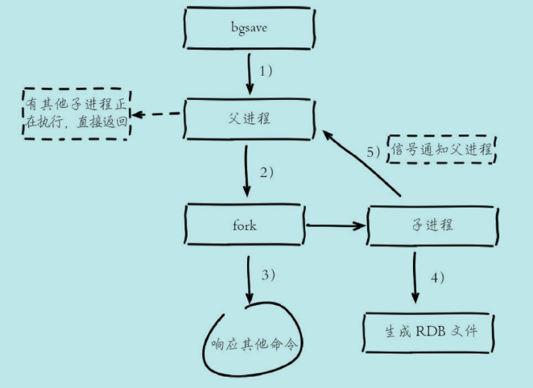
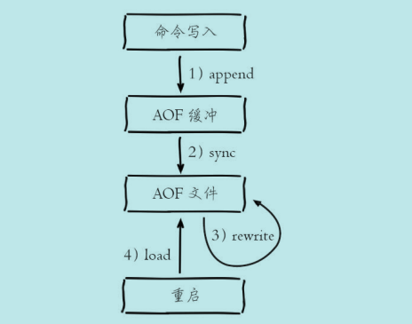
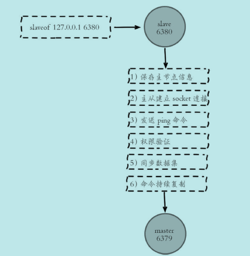
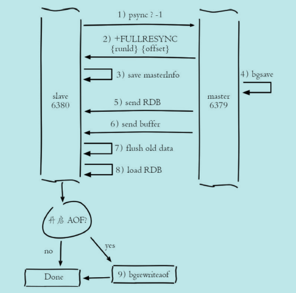
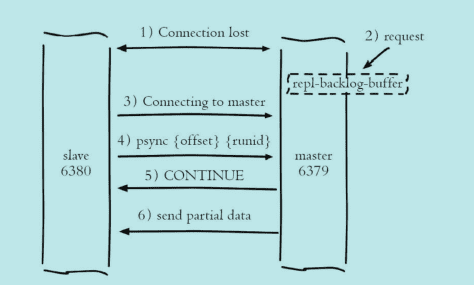

## Redis 为什么这么快

- Redis 中的数据保存在内存中,绝大多数请求都是纯粹的内存操作,非常快速
- 使用多路 I/O 复用模型,非阻塞 IO
- 采用单线程,避免不必要的上下文切换和竞争,也不存在多进程或多线程中各种锁的问题

## Redis 支持的数据类型

Redis 支持如下数据类型

```text
string, 字符串
hash, 哈希,键值映射
list, 列表
set, 无序集合
zset, (带有分值 score 的)有序集合
```

### string

#### 内部编码

- int: 8 个字节的长整型
- embstr: 小于等于 39 字节的字符串
- raw: 大于等于 39 字节的字符串

#### 应用场景

- 缓存: 将后端数据缓存到特定的键中,并设置过期时间,减小后端应用的压力
- 计数: Redis 对整型数据提供自增自减函数,可以作为计数的基础工具,以实现快速计数,查询缓存的功能
- 共享 session: 使用 Redis 将用户的 Session 数据集中管理,每次用户更新或登录可直接从 Redis 中获取 Session
- 限速与过期: 限制用户的访问频率,如限制向同一手机号发送短信验证码的频率.设置验证码的过期时间等

### hash

#### 内部编码

- ziplist(压缩列表): 当元素个数小于 `hash-max-ziplist-entries` 配置(默认 512),同时元素值都小于 `hash-max-ziplist-value` 配置(默认 64 字节)
- hashtable(哈希表): 哈希类型无法满足 ziplist 条件时

#### 应用场景

应用于使用 `string` 不好存储的场景,比如关系型数据库的缓存.

- 将关系型数据库的表字段序列化后用一个键值保存.这么做的优点是可以简化编程,合理的序列化可以提高内存使用率.缺点是序列化与反序列化过程中会有一定的开销.
- 将关系型数据库的表属性使用一对 key-value.但是只用一个键保存.优点是简单直观,可以减少内存空间的使用.缺点是要控制 key-value 个数,控制 hash 内部编码在 ziplist 和 hashtable 之间的转换.

### list

#### 内部编码

- ziplist(压缩列表): 当列表元素个数小于 `list-max-ziplist-entries` 配置(默认 512),同时列表中的元素值都小于 `list-max-ziplist-value` 配置(默认 64 字节)
- linkedlist(链表): 列表类型无法满足 ziplist 条件时

#### 应用场景

- 列表: 列表是按照插入顺序排序,且支持按照索引范围获取元素
- 栈: lpush + lpop
- 队列: lpush + rpop
- 消息队列: lpush + brpop

### set

#### 内部编码

- intset(整数集合): 集合中元素都是整数且元素个数小于 `set-max-intset-entries` 配置(默认 512)
- hashtable(哈希表): 集合类型无法满足 intset 条件时

#### 应用场景

- 标签: 对用户的某类属性打标签,然后对具有相同标签的用户做定向推荐
- 交集/并集: 对用户好友列表求交集/并集后,可以得到用户共同好友与可能认识的人

### zset 有序集合

- ziplist(压缩列表): 当有序集合个数小于 `zset-max-ziplist-entries` 配置(默认 128),同时列表中的元素值都小于 `zset-max-ziplist-value` 配置(默认 64 字节)
- skiplist(跳跃表): 列表类型无法满足 ziplist 条件时

#### 应用场景

> 排行榜系统

- 添加用户点赞数: `zadd user:ranking 3 mike 4 jack` 表示用户 mike 得到 3 个赞,jack 得到 4 个赞
- 删除用户点赞数: `zrem user:ranking jack` 表示从排行榜上删除用户 jack 的点赞记录
- 排行: `zrevramgebyrank user:ranking 0 9` 表示获取点赞数前十名
- 用户排名及分数: `zscore user:ranking mike` 分数 `zrank user:ranking mike` 排名

## RESP,Redis 服务端与客户端的通信协议

- 命令格式

```text
*<参数数量> CRLF
$<参数 1 字节数量> CRLF
参数1
$<参数 2 字节数量> CRLF
参数2
# ...
```

- 响应格式

```text
状态回复: +
错误回复: -
整数回复: :
字符串回复: $
多字符串回复: *
```

## Redis 的持久化方式

Redis 数据保存在内存中,当进程重新启动时,释放内存并重新分配,数据会丢失.持久化就是将 Redis 内存中的数据保存在磁盘上,在进程重新启动时,可以从磁盘加载数据,保证数据持久性

### RDB

#### bgsave 流程说明

1. 执行 bgsave 命令,父进程判断有无子进程在进行持久化操作.如有,则直接返回
2. 父进程执行 fork 操作创建子进程(该过程父进程会阻塞),子进程创建 RDB 文件,并根据父进程内存生成临时快照文件,完成后对原有文件进行原子替换
3. 子进程发送信号给父进程表示完成,父进程更新统计信息



#### `bgsave` 触发方式

> 手动触发

- `save`: `save` 命令会阻塞当前 Redis 服务,直到 RDB 持久化完成为止.
- `bgsave`: `bgsave` 命令会使 Redis 进程 fork 创建出子进程,RDB 持久化过程由子进程完成.fork 过程中,Redis 会阻塞,但一般时间很短.

> 自动触发

- 配置文件中使用 `save m n` 相关配置,表示 m 秒内存在 n 次修改时,自动触发 `bgsave`.
- 从节点全量复制时,主节点自动触发 `bgsave` 生成 RDB 文件,并发送给从节点
- 执行 `debug reload` 命令重新加载 Redis 时,会自动触发.
- 默认情况下,执行 `shutdown` 关闭 Redis 时,如果没有开启 AOF,则自动执行 `bgsave`.

### AOF

#### AOF 流程说明

1. 写入命令以 RESP 协议文本格式追加到 aof_buf 缓冲区中
2. AOF 缓冲区根据配置的同步策略向磁盘做同步操作.同步策略由 `appendfsync` 参数控制,包括以下 3 种策略
   - always: 每次写入都要同步 AOF 文件,在一般的 SATA 盘上,Redis 只能支持大约几百 TPS 写入,与 Redis 高性能背道而驰
   - everysec(默认): 每秒同步一次,理论上在宕机的情况下只丢失 1 秒的数据
   - no: Redis 不做同步,同步硬盘由操作系统负责,通常 30 秒一次.无法保证数据安全.
3. 执行 AOF文件重写,`bgrewriteaof` 或自动触发.
   1. 如果当前进程正在执行 AOF 重写,则直接返回.如果正在执行  `bgsave`,则等 `bgsave` 完成后再执行.
   2. 父进程 fork 子进程,开销与 `bgsave` 一样.子进程能够共享 fork 操作时的内存数据
   3. 父进程 fork 完成后,继续响应其它命令,所有修改操作依然写入 AOF 缓冲区,并根据 `appendfsync` 策略同步到磁盘
   4. 子进程根据内存快照,按照重写规则写入到新的 AOF 文件
   5. 写入完成后,通知父进程,父进程更新统计信息,使用新文件替换老文件,并将缓冲区写入新的 AOF 文件中

> 注意: fork 阻塞,AOF 追加阻塞(磁盘同步过程中,可能造成阻塞)



#### AOF 重写触发方式

> 手动触发

- `bgrewriteaof`: 直接使用 `bgrewriteaof` 命令触发 aof 重写

> 自动触发

根据 `auto-aof-rewrite-min-size` 和 `auto-aof-rewrite-percentage` 参数确定触发时机

- `auto-aof-rewrite-min-size`: 表示 AOF 重写时文件的最小体积.默认为 64M
- `auto-aof-rewrite-percentage`: 表示当前 AOF 文件空间(`aof_current_size`)和上一次重写后 AOF文件大小(`aof_base_size`)的比值

自动触发时机为: `aof_current_size > auto-aof-rewrite-min-size` && `(aof_current_size - aof_base_size)/aof_base_size >= auto-aof-rewrite-percentage`.即当前文件大小大于 AOF 重写的最小体积,且上一次重写后,文件大小增长的百分比超过一定值.

## Redis 复制过程

从节点执行 `slaveof` 命令后

1. 保存主节点信息
2. 建立网络连接,创建用于接收主节点发送复制命令的套接字
3. 发送 ping 命令,检测套接字是否可用,主节点是否可接受处理命令
4. 权限验证,主要是主节点中 `requirepass` 和从节点 `masterauth` 参数
5. 同步数据集
6. 命令持续复制



### 全量复制

1. 从节点发送 `psync ? -1` 命令进行全量数据同步
2. 主节点回复 +FULLRESYNC 响应
3. 从节点接收主节点响应数据保存运行 ID 和偏移量 offset
4. 主节点执行 `bgsave` 保存 RDB 文件到本地,并发送 RDB 到从节点.在这期间主节点仍然响应读写命令,并将数据保存在复制客户端缓冲区内.
5. 从节点接收主节点传送来的数据后清空自身数据,并加载 RDB 文件.加载完成后,主节点将缓冲区内数据发送给从节点,保证数据一致性.
6. 以上步骤完成后,如果从节点开启 AOF 持久化功能,则立刻进行 `bgrewriteaof` 操作.



> 耗时分析

- 主节点 `bgsave` 时间
- 主节点发送 RDB 网络传输时间
- 从节点清空自身数据时间
- 从节点加载 RDB 时间
- 从节点可能的 AOF 重写时间

### 增量复制

1. 从节点发送 `psync {runId} {offset}` 命令进行部分复制
2. 主节点判断 runId 与自身是否一致,如果一致,则根据参数 offset 在复制积压缓冲区查找,如果偏移量在缓冲区中,则发送 +CONTINUE 响应;若不一致或 offset 不在缓冲区中,则退化为全量复制
3. 主节点根据偏移量把复制积压缓冲区内数据发送给从节点,保证主从复制进入正常状态



### 可能存在的问题

#### 读写分离

> 数据延迟

读写分离的数据延时问题是无法避免的,延迟取决于网络带宽和命令阻塞情况.对于无法容忍大量延迟场景,可以编写外部监控程序监听主从节点的复制偏移量,当延迟较大时触发报警或者通知客户端避免读取延迟过高的从节点

> 过期数据

惰性删除: 主节点每次处理读取命令时,都会检查键是否超时,如果超时则执行 `del` 命令删除键对象, 之后 `del` 命令也会异步发送给从节点

定时删除: Redis 主节点在内部定时任务会循环采样一定数量的键,当发现采样的键过期时执行 `del` 命令,之后再同步给从节点

> 从节点故障

客户端维护可用从节点列表,当从节点故障时立刻切换到其他从节点或主节点上.此过程类似于延时过高的监控处理,需要开发人员改造客户端类库

#### 规避全量复制

全量复制是一个非常消耗资源的操作.其场景包括

- 第一次建立复制
- 节点运行 ID 不匹配: 当主从复制关系建立后,从节点会保存主节点的运行 ID.如果此时主节点因故障重启,那么它的运行 ID 会改变,从节点发现主节点运行 ID 不匹配时,会认为自己复制的是一个新的主节点从而进行全量复制.尽量从架构上避免,提供故障转移功能
- 复制积压缓冲区不足: 当主从节点网络中断后,从节点再次连上主节点时会发送 `psync {offset} {runId}` 命令请求部分复制,如果请求的偏移量不在主节点的积压缓冲区内,则无法提供给从节点数据,因此部分复制会退化为全量复制

#### 规避复制风暴

- 单主节点复制风暴
- 单机器复制风暴

> 解决

- 减少主节点(master)挂载从节点(slave)的数量或者采用树状复制结构,加入中间层从节点用来保护主节点
- 应该把主节点尽量分散在多台机器上,避免在单台机器上部署过多的主节点
- 当主节点所在机器故障后提供故障转移机制，避免机器恢复后进行密集的全量复制

## 阻塞原因

- API 或数据结构使用不合理,使用 `slowlog get {n}` 查看最近 n 次慢查询记录.或使用 bigkeys 查看大对象.对于慢查询,Redis 提供了  `showlog-log-slower-than` 设置慢查询的阈值,`showlog-max-len` 设置慢查询日志最多存储多少条
- CPU 饱和,单线程 Redis 处理命令时只能使用一个 CPU.建议使用统计命令 使用统计命令 `redis-cli -h{ip} -p{port} --stat` 查看当前 Redis 使用情况(可能存在 Redis 实例为了追求低内存使用量,过度放宽 ziplist 使用条件(修改 `hash-max-ziplist-entries` 和 `hash-max-ziplist-value` 配置),而 ziplist 的操作算法复杂度在 O(n)到 O(n^2) 之间,导致内存使用率过低,而 CPU 使用率过高
- 持久化阻塞. 在持久化时,如果 fork 操作本身耗时过长,必然会导致主线程的阻塞
- CPU 竞争, Redis 是典型的 CPU 密集型应用,不应与其它 CPU 密集型应用部署在一起.且若做了 CPU 绑定, 父子进程 RDB/AOF 重写时,可能存在 CPU 竞争
- 内存交换(swap),保证 Redis 高性能的一个重要前提是将所有数据保存在内存中.如果数据部分保存在内存中,可能导致 Redis 性能下降.所以务必确保 Redis 实例有足够内存可以使用,并设置 `maxmemory`,降低系统使用 swap 的优先级
- 网络原因

## Redis 有哪几种数据淘汰策略(Redis 的内存溢出控制策略)

Redis使用 `maxmemory` 参数限制最大可用内存.当 Redis 所用内存达到 `maxmemory` 上限时会触发相应的溢出控制策略,包含如下 6 种策略,且内存溢出控制策略可以采用 `config set maxmemory-policy {policy}` 动态配置

名称 | 解释
:---: | :---:
noeviction | 默认策略,不会删除任何数据,拒绝所有写入操作并返回错误信息(OOM),此时 Redis 只响应读操作
volatile-lru | 根据LRU算法删除设置了超时属性的键,直到空间足够;如果没有可删除的键,则回退到noeviction策略
allkeys-lru | 根据LRU算法删除键,不管数据有没有设置超时属性,直到空间足够
allkeys-random | 随机删除所有键,直到腾出足够空间为止
volatile-random | 随机删除过期键,直到腾出足够空间为止
volatile-ttl | 根据键值对象的ttl属性,删除最近将要过期数据.如果没有,回退到 noeviction 策略

## Redis 内存优化有哪些方式

- 精简键值大小,键值字面量精简,控制 redis 内部编码类型以节省内存
- 数据优先使用整数,并使用对象共享池优化小整数大小
- 优化字符串使用,通过修改数据结构来节省内存.如 json 格式的字符串转化为 hash
- 合理设计数据保存类型,控制键

## 哨兵机制实现原理

### 三个定时任务

1. 每隔 10 秒,Sentinel 节点向主/从节点发送 `info` 命令获取最新拓补结构
2. 每隔 2 秒,Sentinel 节点向 Redis 数据节点 `__sentinel__:hello` 频道发送该 Sentinel 节点对于主节点的判断及当前 Sentinel 节点信息.每个 Sentinel 也会订阅该频道,了解其它 Sentinel 以及对主节点的判断(主要用于发现新的 Sentinel 节点,并交换主节点状态,作为客观下线及领导者选举的依据)
3. 每隔 1 秒,Sentinel 向主从节点,Sentinel 节点发送 ping 命令做心跳检测(当节点不可达时做主观下线及领导者选举的依据)

### 故障恢复过程

1. 主观下线

由定时任务 3 完成,当节点不可达时,认为该节点下线

2. 客观下线

当 Sentinel 主观下线节点是主节点时,该节点通过 `sentinel is-master-down-by-addr` 向其他节点询问对该主节点的判断,当主观下线超过 `<quorum>` 时,作出客观下线

3. 领导者选举

- 主观下线后,该节点通过 `sentinel is-master-down-by-addr` 命令,要求将自己设置为领导者.
- 收到该命令的 Sentinel 节点,如果没有同意过其他 Sentinel 节点的命令,则同意,否则拒绝
- 当 Sentinel 节点的票数大于等于 `max(quorum, num(sentinels)/2 + 1)` 它将成为领导者

4. 故障转移

领导者选举选出的节点负责故障转移

- 在从节点中选出一个节点执行 `slaveof no one` 让其成为新主节点
- 向剩余节点发送命令,让他们成为新主节点的从节点
- 将原来主节点更新为从节点,并保持关注,恢复后进程复制

> 设置 slave 节点资源池,实时掌握从节点状态,可保证从节点高可用

## 集群原理

Redis 集群采用虚拟槽分区的,所有的键根据哈希函数映射到 0-16383 槽内.

缺点:

- 批量操作受限制
- 复制结构只支持一层

### 集群搭建

1. 准备节点

```bash
cluster-enabled yes # 开启集群模式
cluster-config-file "" # 指定集群配置文件
```

2. 节点握手,`cluster meet <redisIP> <redisPort>`
3. 分配槽,配置主从.`cluster addlots <lot>`, `cluster replicate <redisRunId>`

### 集群节点通信

Gossip,流言协议

ping,pong,meet,fail

## Redis 缓存

### 缓存和数据库数据一致性问题

分布式环境下非常容易出现缓存和数据库间数据一致性问题,如果项目对缓存的要求是强一致性的,那么就不要使用缓存.我们只能采取合适的策略来降低缓存和数据库间数据不一致的概率,而无法保证两者间的强一致性.合适的策略包括合适的缓存更新策略,更新数据库后及时更新缓存,缓存失败时增加重试等机制.

### Redis 缓存雪崩及其解决

缓存中大量 key 在同一时间失效,导致大量的请求全部落在了数据库上,数据库必然扛不住,真实情况可能DBA 都没反应过来直接挂了.此时,如果重启数据库,但立马又被新流量给打死了,导致后端数据库无法启动的情况.依赖该库所有接口几乎都会报错,如果没做熔断等策略基本上就是服务完全不可用.

> 解决办法

- 设置 key 随机失效时间
- 将热点数据均匀分布在不同的 Redis 库中也能避免全部失效.或设置热点数据永不过期,有更新操作则更新缓存

### 缓存穿透和击穿

通常出于容错的考虑,如果从存储层查不到数据则不写入缓存层.缓存穿透是指用户不断对缓存和数据库中都没有的数据发起请求,将导致不存在的数据每次请求都要到存储层去查询,失去了缓存保护后端存储的意义.这样不断攻击导致数据库压力很大,严重的话会击垮数据库

> 解决: 在接口层增加校验,比如用户鉴权,参数做校验,对不合法的请求直接返回,而不查询缓存与数据库.

缓存击穿不同的是缓存击穿是指一个 Key 非常热点,在不停地扛着大量的请求,大并发集中对这一个点进行访问.当这个 Key 在失效的瞬间,持续的大并发直接落到了数据库上,就在这个 Key 的点上击穿了缓存

> 解决: 设置热点数据永不过期

## Redis 安全策略

- 简单的密码验证,通过 `requirepass` 配置
- 对危险命令重命名,通过 `rename-command` 设置,危险命令包括
  - `keys`: 如果键值较多,存在阻塞 Redis 的可能性
  - `flushall`/`flushdb`: 数据全部被清除
  - `save`: 如果键值较多,存在阻塞 Redis 的可能性
  - `debug`: 例如 debug reload 会重启 Redis
  - `config`: config 包含 redis 配置相关命令,应该交给管理员使用
  - `shutdown`: 停止 Redis
- bind: 选择指定网卡做绑定,而不要绑定 0.0.0.0
- 修改默认端口
- 尽量不要使用 root 用户运行
- 定期备份数据

## Redis 分布式锁的注意事项

- 避免死锁

一个客户端获取锁成功,但是在释放锁之前崩溃了.可通过设置锁的超时时间

- 自动续约

在方法未结束之前,锁已经失效.可以通过启动一个监控线程,监控线程的运行状态,如果锁快要过期,则自动续约

- 避免其它客户端解锁

一个客户端获取锁成功,但另一个客户端尝试解锁.可以通过在加锁时设置随机变量,解锁时对该随机变量进行校验实现解决
