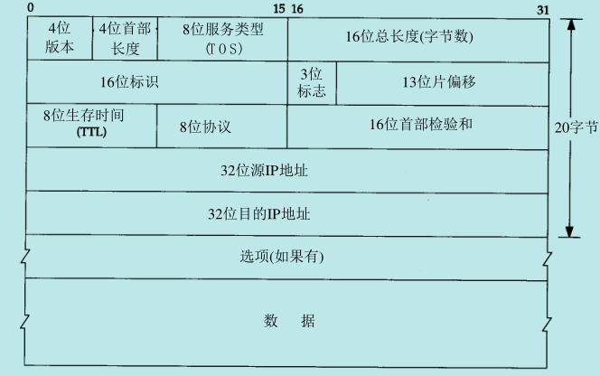
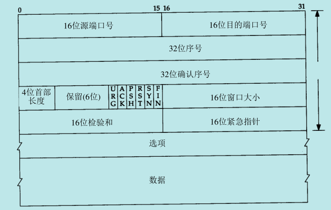
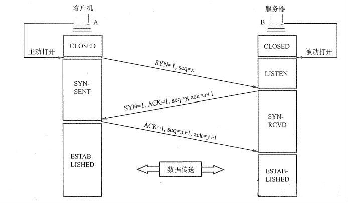
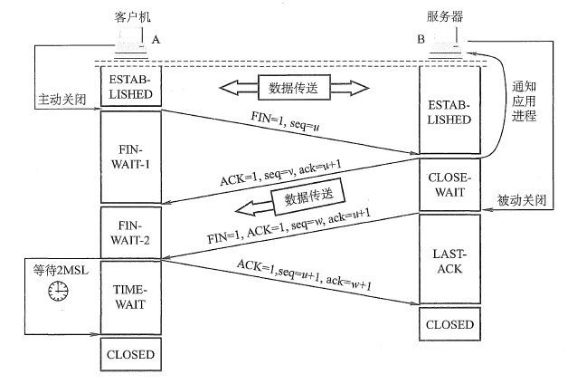

## OSI 七层模型,TCP/IP 四层模型

OSI从上到下依次是 应用层 -> 表示层 -> 会话层 -> 传输层 -> 网络层 -> 数据链路层 -> 物理层

TCP/IP 从上到下依次是 应用层 -> 传输层 -> IP层 -> 网络接口层

## TCP 与 UDP 有什么区别

- TCP 是面向连接的,通信之前需要进行三次握手,建立连接,通信结束后需要四次挥手,断开连接; UDP是无连接的,即发送数据之前不需要建立连接
- TCP 提供可靠的服务,以收到确认,超时重传,重新排序等机制提供数据可靠性; UDP 不保证数据的可靠性
- TCP 面向字节流,实际上是 TCP 把数据看成一连串无结构的字节流,一个数据包可以拆分成若干组进行发送; UDP 是面向报文的,一个报文只能一次发完
- 每一条 TCP 连接只能是点到点的; UDP 支持一对一,一对多,多对一和多对多的交互通信
- TCP 的逻辑通信信道是全双工的可靠信道; UDP 则是不可靠信道
- TCP 相对于 UDP 来说要求系统资源较多

## TCP/IP 首部





- 16 位源端口号,16位目的端口号: 用于寻找发送端和接收端的应用进程,加上IP首部的源端 IP 及目的 IP,唯一确认一个 TCP 连接
- 32 位序号: 标识发送的数据字节流,标识在这个报文段中的第一个数据字节,2^32 - 1 后重新从 0 开始.包含该主机选择的连接的ISN(Initial Sequence Number),要发送的第一个数据字节序号为 ISN + 1.
- 32 位确认序号: ACK为 1 时有效,确认号应该是上次成功收到的数据字节序号 + 1.
- 4 位首部长度: 首部中 32bit 的数目,一般为 5,也就是 20 字节
- URG: 紧急指针
- ACK: 确认序号有效
- PSH: 接收方应尽快将此报文段交给应用层
- RST: 重建连接
- SYN: 同步序号,用来发起一个新连接
- FIN: 发端完成发送任务
- 16 位窗口大小: TCP流量控制,字节数，起始于确认序列号指明的值,接收端期望收到的字节,最大为65535.
- 16 位检验和：包括计算 TCP 首部和数据综合的二进制反码和检验和.用于接收端校验
- 16 位紧急指针：URG为 1 时有效,是一个正向的偏移量,和序号字段值相加表示最后一个字节的序号

## TCP 三次握手,四次挥手过程

### TCP 三次握手



1. 客户端发送连接请求报文(`SYN=1,seq=x`)到服务器,并进入 `SYN_SEND` 状态,等待服务端确认
2. 服务端收到后,回传一个确认报文(`SYN=1,seq=y,ACK=1,ack=x+1`)以示传达确认信息,此时服务器进入 `SYN_RECV` 状态
3. 客户端接收服务端的确认包,向服务器发送确认包(`ACK=1,seq=x+1,ack=y+1`).随后,客户端与服务端建立连接,进入 `ESTABLISHED` 状态,完成三次握手

握手过程中状态码如下

```text
SYN = 1,ACK = 0,seq = x;
SYN = 1,ACK = 1,seq = y,ack = x+1;
SYN = 0,ACK = 1,seq = x+1,ack=y+1
```

#### 为什么需要三次握手,两次不行吗

- 主要是为了防止已失效的请求报文段突然又传送到了服务端而产生连接的误判,造成服务端资源/时间的浪费.

> 考虑如下场景: 客户端发送报文没有直接到达,而是在某个网络节点滞留了.一段时间后,连接释放,但此时报文到达服务端.服务端误以为是客户端发来建立请求的报文,而给出响应.但由于现在 客户端并没有发出建立连接的请求,因此不会理睬服务端的确认报文.如果两次握手,此时服务端认为连接已经建立,会等待客户端发送数据,造成服务端资源浪费

- 确保服务端发送的确认报文客户端可以收到

#### 第三次握手中,如果客户端的 ACK 未送达服务器,会怎样

- 服务端: 重新发送之前的 SYN + ACK.默认重发五次,之后自动关闭连接进入 CLOSED 状态,此时会以 RST 报文应答
- 客户端: 在接收到服务端超时重发的 SYN + ACK 报文后,重新发送 ACK 报文.

#### 如果已经建立了连接,但客户端出现了故障怎么办

服务器每收到一次客户端的请求后都会重新复位一个计时器,时间通常是设置为 2 小时.若两小时还没有收到客户端的任何数据,服务器就会发送一个探测报文段,以后每隔 75 秒钟发送一次.若一连发送 10 个探测报文仍然没反应,服务器就认为客户端出了故障,接着就关闭连接.

#### 三次握手有什么缺陷

伪造大量 IP 的向 server 发送 TCP 连接请求报文包,从而将 server 的半连接队列(即 server 收到连接请求 SYN 之后将 client 加入半连接队列中)占满,从而使得 server 拒绝其他正常的连接请求,即拒绝服务攻击.

### TCP 四次挥手



1. 客户端发送连接释放报文(`FIN=1,seq=u`),并停止发送数据,客户端进入 `FIN_WAIT_1` 状态
2. 服务器收到连接释放报文,发出确认报文(`ACK=1,seq=v,ack=u+1`),服务器进入 `CLOSE_WAIT` 状态.客户端接收到服务器的确认请求后,客户端进入`FIN_WAIT_2` 状态,等待服务器发送连接释放报文.此时客户端不再向服务端发送数据,若服务端发送数据,客户端依然接受.
3. 服务端将最后的数据发送完毕后,向客户端发送释放报文(`FIN=1,ACK=1,seq=w,ack =u+1`),服务端进入 `LAST_ACK` 状态.
4. 客户端收到服务端连接释放报文后,必须回复确认(`ACK=1,seq=u+1,ack=w+1`),客户端进入 `TIME_WAIT` 状态,时长为 2∗MSL(报文最长寿命).

挥手过程中状态码如下

```text
1. FIN = 1,seq = u;
2. ACK = 1,seq = v,ack = u+1;
3. FIN = 1,ACK = 1,seq = w,ack =u+1;
4. ACK = 1,seq = u+1,ack = w+1
```

#### 为什么最后要等待 2 * MSL

- 保证客户端发送的最后一个 ACK 报文能够到达服务器,保证可靠的终止 TCP 连接.TCP 内部存在超时重传机制,如果服务端在发出释放报文后,没有收到确认报文,服务端会重新发送一次,客户端就能够在 2 * MSL 内收到重传报文
- 保证新连接中不会出现旧连接的请求报文.客户端发送完最后一个确认报文后,在这个 2 * MSL 时间中,就可以使本连接持续的时间内所产生的所有报文段都从网络中消失.

#### 为什么建立连接是三次握手,而关闭连接却是四次挥手呢

- 建立连接

因为服务端在 LISTEN 状态下,收到建立连接请求的SYN报文后,把ACK和SYN放在一个报文里发送给客户端.

- 关闭连接

当收到对方的 FIN 报文时,仅表示对方不再发送数据但还能接收收据,我们也未必把全部数据都发给了对方,所以我们可以立即关闭,也可以发送一些数据给对方后,再发送 FIN 报文给对方表示同意关闭连接.因此关闭连接的 ACK 和 FIN 一般会分开发送.

## TCP 以什么方式提供数据可靠性

- 将数据切分为最合适发送的数据块
- 计时,收到后确认与超时重传.当 TCP 发出一个段后,它会启动一个定时器,等待目的端确认收到这个报文段.如果不能及时收到一个确认,将重发这个报文
- 首部与数据校验和确保数据在传输过程中的任何变化
- 流量控制,防止较快主机致使较慢主机的缓冲区溢出
- 重新排序机制确保收到的数据以正确的顺序交给其他层
- 丢弃重复数据

## TCP 如何实现流量控制/最大化利用带宽

滑动窗口协议.目的是防止发送方发送速率太快,接收方缓存区不够导致溢出.接收方会维护一个接收窗口 receiver window(窗口大小单位是字节).接收窗口的大小是根据自己的资源情况动态调整的,在返回 ACK 时将接收窗口大小放在 TCP 报文中的窗口大小字段告知发送方.发送窗口的大小不能超过接受窗口的大小.只有当发送方发送并收到确认之后,才能将发送窗口右移.

### 接收窗口为 0 时会怎样

如果接收方没有能力接收数据,就会将接收窗口设置为 0.这时发送方必须暂停发送数据,但是会启动一个持续计时器(persistence timer),到期后发送一个大小为 1 字节的探测数据包,以查看接收窗口状态.如果接收方能够接收数据,就会在返回的报文中更新接收窗口大小,恢复数据传送.

## TCP 拥塞控制是怎么实现的

- TCP 拥塞检测

针对丢包情况,TCP 采取的首要机制是重传.当网络处于拥塞崩溃状态时,网络却需要传输更多的数据包,结果只会更糟糕.TCP 中,丢包也被用作判断拥塞是否发生与否的标准.

- 减缓 TCP 发送

TCP 在发送端引入了一个窗口控制变量,确保发送窗口大小不超过接收端接收能力和网络传输能力.此变量称为拥塞窗口(congestion window),记作 cwnd.因此发送端实际窗口大小 W 就是接收端通知窗口 awnd 和拥塞窗口 cwnd 的较小者.

- 经典算法

1. 慢启动: 刚开始发送数据时,先把拥塞窗口设置为一个最大报文段 MSS 的数值,每收到一个新的确认报文之后,就把拥塞窗口加 1 个MSS.这样每经过一个 RTT,拥塞窗口的大小就会加倍.随着数据的传输,拥塞窗口呈指数型增长,在 k 轮数据传输后,W=2^k
2. 拥塞避免: 当拥塞窗口的大小达到慢开始门限(slow start threshold)时,开始执行拥塞避免算法,拥塞窗口大小不再指数增加,而是线性增加,即每经过一个传输轮次只增加1 MSS.

## DNS 域名解析过程

1. 应用首先检查缓存中有没有这个域名对应的解析过的 IP 地址.如果缓存中有,则返回缓存中的 IP 地址.否则进行下一步
2. 查找本机的 host 文件, Linux 为 `/etc/hosts`,Windows 为 `C:\Windows\System32\drivers\etc\hosts`.若查到,则返回.否则进行下一步
3. 发送请求到 DNS 服务器 Linux 为 `/etc/resolv.conf`.DNS 服务器在收到客户机的请求后,首先检查 DNS 服务器的缓存,若查到请求的地址或名字,即向客户机发出应答信息.否则在数据库中查找,若查到请求的地址或名字,即向客户机发出应答信息
4. 若没有找到,则将请求发给根域 DNS 服务器,并依序从根域查找顶级域,由顶级域查找二级域...直至找到要解析的地址或名字,即向客户机所在网络的 DNS 服务器发出应答信息,DNS 服务器收到应答后现在缓存中存储,然后,将解析结果发给客户机
