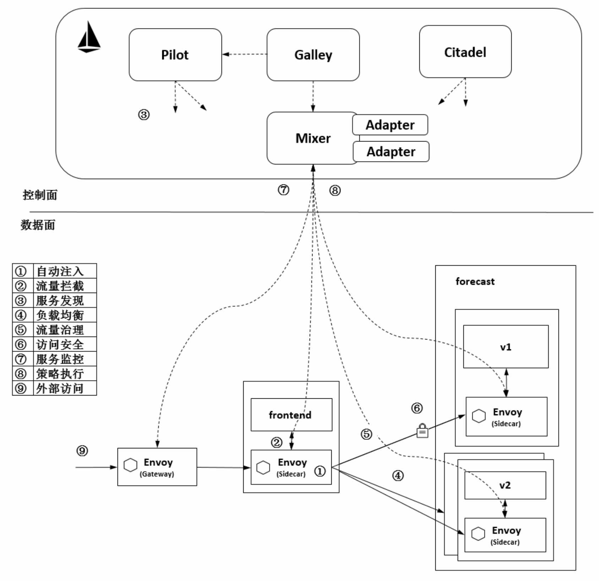
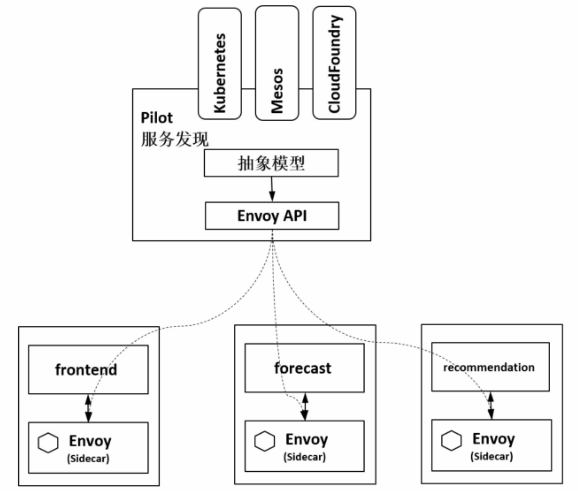

本文章为[《云原生服务网格Istio：原理、实践、架构与源码解析》](https://item.jd.com/12538407.html)第 1-2 章读书笔记.如果在学习过程中有理解不准确的地方,请以原书为准.

# istio 简介

[Istio](https://istio.io/) 是一个与 [Kubernetes](https://kubernetes.io/) 紧密结合的适用于云原生场景的 Service Mesh 形态的用于服务治理的开放平台

## istio 可以做什么

- 自动通过服务发现获取服务实例列表,并根据负载均衡策略选择一个服务实例
- 对服务双方启用双向认证和通道加密
- 设置最大连接数,最大请求数,访问超时及设置限流机制等对服务进行保护
- 对请求进行重试
- 将一定特征的服务重定向,实现灰度发布
- 记录调用链,进行分布式追踪.根据访问数据形成完整的应用访问拓扑

# istio 架构概述

## istio 工作机制

- `自动注入`: 在创建应用程序时自动注入 Sidecar 代理.在 Kubernetes 场景下创建 Pod 时,Kube-apiserver 调用管理面组件的 Sidecar-Injector 服务,自动修改应用程序的描述信息并注入 Sidecar.在创建Pod时,在创建业务容器的同时在Pod中创建 Sidecar 容器
- `流量拦截`: 在 Pod 初始化时设置 iptables 规则,当有流量到来时,基于配置的 iptables 规则拦截业务容器的 Inbound 流量和 Outbound 流量到 Sidecar 上.应用程序感知不到 Sidecar的存在,还以原本的方式进行互相访问
- `服务发现`: 服务发起方的 Envoy 调用管理面组件 Pilot 的服务发现接口获取目标服务的实例列表
- `负载均衡`: 服务发起方的 Envoy 根据配置的负载均衡策略选择服务实例,并连接对应的实例地址
- `流量治理`: Envoy 从 Pilot 中获取配置的流量规则,在拦截到 Inbound 流量和 Outbound 流量时执行治理逻辑
- `访问安全`: 在服务间访问时通过双方的 Envoy 进行双向认证和通道加密,并基于服务的身份进行授权管理.证书和密钥由管理面组件 Citadel 维护
- `服务遥测`: 在服务间通信时,通信双方的 Envoy 都会连接管理面组件 Mixer 上报访问数据,并通过 Mixer 将数据转发给对应的监控后端
- `策略执行`: 在进行服务访问时,通过Mixer连接后端服务来控制服务间的访问,判断对访问是放行还是拒绝
- `外部访问`: 在网格的入口处有一个 Envoy 扮演入口网关的角色

## istio 服务模型

istio 服务模型与 kubernetes 中服务模型对应关系如下

istio | kubernetes
:---: | :---:
service | service
服务版本 | Deployment,使用 app 和 version 标签区分不同服务的不同版本
服务实例 | Endpoint

## istio 主要组件

> istio-pilot 服务发现和服务治理

- 服务发现

pilot 提供各种服务发现的 adapter 实现服务发现机制,并将其构造和转换成 istio 的服务发现模型.如 kubernetes 源数据`service(service),endpoint(instance),deployment(version)`

- 服务治理

向数据面下发规则,pilot 负责将各种规则转换成 Envoy 可识别的格式,通过标准的 xDS 协议发送给 Envoy,指导Envoy完成动作.

其规则的实现方式包括 `VirtualService,DestinationRule,Gateway,ServiceEntry` 等流量治理规则,也包括认证授权等安全规则.

> istio-mixer 数据收集,策略执行

- 使用 telemetry 服务组件收集遥测数据

当网格中的两个服务间有调用发生时,服务的代理 Envoy 就会上报遥测数据给 istio-telemetry 服务组件,istio-telemetry 服务组件则根据配置将生成访问 Metric 等数据分发给后端的遥测服务

- 使用 policy 服务组件管理网络策略
 
数据面在转发服务的请求前调用 istio-policy 的 Check 接口检查服务间通信的策略,然后根据配置将请求转发到对应的 adapter 进行检查,给代理返回允许访问还是拒绝

> istio-citadel 安全中心

istio-citadel 是 istio 的核心安全组件,提供了自动生成,分发,轮换与撤销密钥和证书功能.

citadel 一直监听  kube-apiserver,以 secret 的形式为每个服务都生成证书密钥,并在 pod 创建时挂载到 pod 上,代理容器使用这些文件来做服务身份认证,进而代理两端服务实现双向 TLS 认证,通道加密,访问授权等安全功能

> istio-galley 控制面上的配置中心

istio-galley 在控制面上向其它组件提供支持,它用于验证配置信息的格式和内容的正确性,并将这些配置信息提供给管理面的 Pilot 和 Mixer.

> istio-sidecar-injector 自动注入

istio-sidecar-injector 主要负责自动注入,在创建 Pod 时自动调用 istio-sidecar-injector 向 pod 中注入 sideCar 容器

> istio-proxy,Envoy,Sidecar Istio数据面轻量代理

综合/分析 pilot 中规则,配置到 proxy,类似于4 和 7 层代理.作为服务网格的数据面,Envoy 提供了动态服务发现,负载均衡,TLS,HTTP/2 及 gRPC代理,熔断器,健康检查,流量拆分,灰度发布,故障注入等功能

> istio-ingressgateway 服务网格入口网关

istio-ingressgateway 是服务网格入口处的网关,从网格外访问网格内的服务就是通过这个组件进行的.该组件是一个 Loadbalancer 类型的 Service,并开放了一组端口,用于外部访问.

# 非侵入的流量治理

## 原理

> 目标

以基础设施的方式提供给用户非侵入的流量治理能力,用户只需
关注自己的业务逻辑开发,无须关注服务访问管理

> 流程

1. 管理员通过命令行或 API 创建流量规则
2. Pilot 将流量规则转换为 Envoy 的标准格式,并下发给 Envoy(转向数据面)
3. Envoy 拦截 Pod 上本地容器的 Inbound 流量和 Outbound 流量
4. 在流量经过 Envoy 时执行对应的流量规则,对流量进行治理

> 应用场景和功能

- 负载均衡

服务注册: 各服务将服务名和服务实例的对应信息注册到服务注册中心
服务发现: 在客户端发起服务访问时,以同步或者异步的方式从服务注册中心获取服务对应的实例列表
负载均衡: 据配置的负载均衡算法从实例列表中选择一个服务实例.目前支持的负载均衡算法有轮询,随机和最小连接数算法

- 服务熔断

故障检测和处理逻辑,防止临时故障或意外导致系统整体不可用.最典型的场景是防止网络和服务调用故障级联发生,限制故障的影响范围,防止故障蔓延导致系统整体性能下降或雪崩

- 故障注入

主要用于测试其健壮性和应对故障的能力,例如异常处理,故障恢复等Istio 的故障注入是在网格中对特定的应用层协议进行故障注入,可以模拟出应用的故障场景.

如注入 HTTP Code 503(服务端异常),请求延时(模拟响应慢)

- 灰度发布

新老版本同时在线,新版本只切分少量流量出来,在确认新版本没有问题后,再逐步加大流量比例

其中灰度发布主要有金丝雀发布,蓝绿发布,AB 测试 3 种方式

- 服务访问入口

Istio 中通过 Ingress Gateway 访问网格内的服务,做四层到六层的端口,TLS配置等基本功能,VirtualService则定义七层路由等丰富内容

- 外部接入服务治理

Istio 通过 ServiceEntry 资源对象将网格外的服务注册到网格上,然后像对网格内的普通服务一样对网格外的服务访问进行治理.有时需
要有一个专门的 Egress Gateway 来提供统一的出口网关