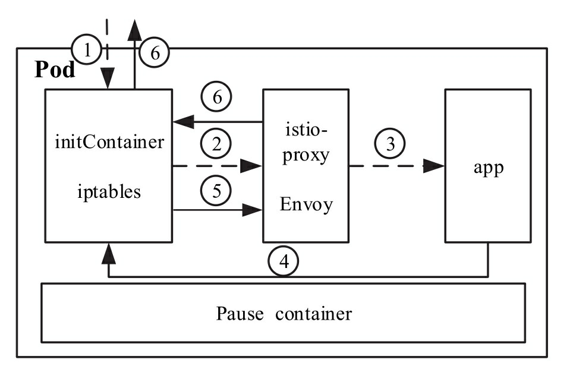

# Sidecar 注入

在 Kubernetes 中,Sidecar 容器与应用容器共存于同一个 Pod 中,共享同一个 Network Namespaces,因此Sidecar容器与应用容器共享同一个网络协议栈,这是 Sidecar 能够通过 iptables 拦截应用进出口流量的根本原因

在 istio 进行 sidecar 注入有两种方式,一种是通过 istioctl 命令行注入,另一种是通过 Sidecar Injector 自动注入.这两种方式的最终目的都是在应用 Pod 中注入 init 和 istio-proxy 这两个 Sidecar 容器.

## 原理

Sidecar Injector 是 Istio 中实现自动注入 Sidecar 的组件,它是以 Kubernetes 准入控制器 Admission Controller 的形式运行的.Admission Controller 的基本工作原理是拦截 Kube-apiserver 的请求,在对象持久化之前,认证鉴权之后进行拦截.Kubernetes 允许用户以 Webhook 的方式自定义准入控制器,Sidecar Injector 就是这样一种特殊的 MutatingAdmissionWebhook

Sidecar Injector 只在创建 Pod 时进行 Sidecar 容器注入,在 Pod 的创建请求到达 kube-apiserver 后,首先进行认证鉴权,然后在准入控制阶段,kube-apiserver 以 REST 的方式同步调用 Sidecar Injector Webhook 服务进行 init 与 istio-proxy 容器的注入,最后将 Pod 对象持久化存储到 etcd 中

Istio中的 MutatingWebhook 配置如下
```yaml
apiVersion: admissionregistration.k8s.io/v1beta1
kind: MutatingWebhookConfiguration
metadata:
  name: istio-sidecar-injector

  labels:
    app: sidecar-injector
    release: istio
webhooks:
  - name: sidecar-injector.istio.io
    clientConfig:
      service:
        name: istiod
        namespace: istio-system
        path: "/inject"
      caBundle: ""
    rules:
      - operations: [ "CREATE" ]
        apiGroups: [""]
        apiVersions: ["v1"]
        resources: ["pods"]
    failurePolicy: Fail
    namespaceSelector:
      matchLabels:
        istio-injection: enabled

```
由以上配置可见, Sidecar Injector 只对标签匹配 `istio-injection：enabled` 的命名空间下的Pod资源对象的创建生效

# Sidecar 流量拦截

Sidecar 流量拦截基于 iptables 规则(init 容器启动时设置规则),拦截应用容器 Inbound/Outbound 的流量




1. Inbound 流量在进入 Pod 的网络协议栈时首先被 iptables 规则拦截
2. iptables 规则将数据包转发给 Envoy
3. Envoy 再根据自身监听器的配置,将流量转发给应用进程
4. Outbound流量由应用发出,首先被 iptables 规则拦截
5. iptables 规则将出口数据包转发给Envoy
6. Envoy 再根据自身配置决定是否将流量转发到容器外

## 流量拦截原理

Istio中,流量拦截的实现依赖 initContainer iptables 规则的设置,目前有 `REDIRECT` 和 `TPROXY` 两种流量拦截模式.

`REDIRECT` 模式虽然会进行源地址转换,但依旧是默认的设置.原因如下:
- 配合 Istio 提供的遥测数据依然可以进行调用链分析
- Kubernetes 平台上 Pod 及其 IP 地址并不是持久不变的

istio 流量拦截的规则通过 initContainer 进行设置,initContainer 的启动参数及镜像如下

```yaml
initContainers:
- args:
  - "-p"  # 指定 Envoy 转发 TCP 流量的端口
  - 15001
  - "-z"
  - "15006"
  - "-u"  # 指定用户 id,由该用户发出的数据包不被 iptables 转发,防止死循环
  - 1337
  - "-m"  # 指定 iptables 拦截模式,默认为REDIRECT
  - "REDIRECT"
  - "-i"  # 目的地址在此范围内的数据包将会被转发到 Envoy
  - "*"
  - "-x"  # 目的地址在此范围内的数据包不会被转发
  - ""
  - "-b"  # 入口端口,进入目标端口的数据包会被转发到 Envoy,默认为应用服务监听端口
  - "9080"
  - "-d"  # 入口端口,进入目标端口的数据包不会被转发到Envoy,默认为 15020,这是 Sidecar 容器的健康检查端口
  - "15020" 
```