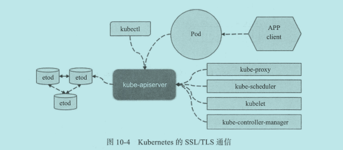

## 访问控制概述

API Server 作为 Kubernetes 集群系统的网关,是访问及管理资源对象的唯一入口,余下所有需要访问集群资源的组件都要经过此网关进行集群访问和管理.这些客户端均要经过由 API Server 访问或改变集群状态并完成数据存储,并由它对每一次的访问请求进行合法校验,包括用户身份,操作权限验证及操作是否符合全局规范的约束等.所有检查均正常且对象的配置信息合法性检验无误后才能访问或存入后端存储系统 etcd 中.

客户端认证操作由 API Server 配置的一个到多个认证插件完成.收到请求后,API Server 依次调用为其配置的认证插件来认证客户端身份,直到其中一个插件可以识别出请求者的身份为止.授权操作由一到多个授权插件进行,它负责确定哪些通过认证的用户是否有权限执行其发出的资源操作请求.通过授权检测的用户所请求的修改相关的操作还要经由一个到多个准入控制插件的遍历检测.其中任何检查失败都可能会导致写入操作失败.

### 用户帐户和用户组

客户端访问 API Server 的途径通常有三种: kubectl,客户端库或直接使用 REST 接口.而可以执行此类请求的主体可以分为常规用户(User Account)和服务帐号(Service Account)

- `User Account`: 指独立于 Kubernetes 之外的其它服务管理的服务帐号,如密钥等
- `Service Account`: 由 Kubernetes API 管理的账号,用于为 Pod 之中的服务进程在访问 Kubernetes API 时提供身份标识.Service Account 通常要绑定于特定的名称空间.附带着一组存储为 Secret 的用于访问 API Server 的凭据.

Kubernetes 中用户组只是用户帐号的逻辑集合,它本身没有操作权限,但附加于组上的权限可以由其内部的所有哟过户继承,以实现高效的授权管理机制.Kubernetes 有着以下几个内建的用于特殊目的的组.

- `system:unauthenticated`: 未通过认证测试的用户所属的组
- `system:authenticated`: 认证成功后用户自动加入的一个组
- `system:serviceaccounts`: 当前系统上的所有 Service Account 对象
- `system:serviceaccounts:<namespace>`: 特定名称空间内所有 Service Account 对象.

### 认证,授权与准入控制

API Server 处理请求过程中,认证插件负责鉴定用户身份,授权插件用于操作权限许可鉴别,准入控制则用于在资源对象创建,删除,更新或连接操作时实现更精细的许可检查.

#### 认证

Kubernetes 使用身份认证插件对 API 请求进行身份认证,支持的认证方式包括客户端证书,承载令牌,身份验证代理或 HTTP basic 认证等.具体如下:

- X509 客户端证书认证: 客户端请求中携带 X509 格式的数字证书用于认证.
- 静态令牌文件: 保存着令牌信息文件,由 kube-apiserver 的命令行选项 `--token-auth-file` 加载,服务器启动后不可更改.
- 引导令牌(Bootstrap Token): 有新的工作节点首次加入时,Master 使用引导令牌确认节点身份的合法性后自动为其签署数字证书以用于后续的安全通信,使用 `kubeadm join` 将节点加入 kubeadm 初始化的集群时使用的即是这种认证方式.
- 静态密码文件: 用户名和密码等令牌以明文的格式存储 CSV 格式文件,由 `kube-apiserver` 使用 `--basic-auth-file` 选项进行加载.
- 服务帐户令牌: 由 kube-apiserver 自动启用,并可以使用 `--service-account-key-file` 验证承载令牌的密钥,省略时将使用 `kube-apiserver` 自己的证书匹配的私钥文件.
- 匿名请求: 未被任何验证机制明确拒绝的用户即为匿名用户,其被自动标识为 `system:anonymous`,并隶属于 `system:unauthenticated` 用户组.在 API Server 启用了除 `AlwaysAllow` 以外的认证机制时,匿名用户处于启用状态.可以使用 `--anonymous-auth=false` 将其禁用.

API Server 是一种 REST API,除了身份认证信息之外,请求报文还需要提供操作方法及其目标对象.具体如下:

- API: 定义请求的目标是否是一个 API 资源
- Request path: 请求的非资源路径,如 "/api" 或 "/healthz"
- API group: 需要访问的 API 组,仅对资源型请求有效
- Namespace: 目标资源所属的名称空间,仅对隶属于名称空间类型的资源有效
- API request verb: API 请求类的操作,资源型请求,包括 `get,list,create,update,patch,watch,proxy,redirect,delete,deletecollection` 等
- HTTP request verb: HTTP 请求类的操作,非资源型请求要执行的操作,如 `get,post,put,delete`
- Resource: 请求目标资源的 ID 或名称
- Subresource: 请求的子资源

#### 授权

通过身份认证后的请求需要转交给授权插件进行许可检查.API Server 支持使用四类内建的授权插件来定义用户的操作权限

- Node: 基于 Pod 资源的目标调度节点来实现对 kubelet 的访问控制
- ABAC(attribute-based access control): 基于属性的访问控制
- RBAC(role-based access control): 基于角色的访问控制
- Webhook: 基于 HTTP 回调机制通过外部 REST 服务检查确认用户授权的访问控制

#### 准入控制

准入控制用于在客户端请求经过身份认证和授权检查之后,在对象持久化存储 etcd 之前拦截请求,用于实现在资源的创建,更新和删除操作期间强制执行对象的语义验证功能.主要包含如下几种:

- AlwaysAdmit: 允许所有请求
- AlwaysDeny: 拒绝所有请求
- AlwaysPullImages: 总是下载镜像
- NamespaceLifecycle: 拒绝于不存在的名称空间中创建资源,删除名称空间会删除其下的所有资源
- ServiceAccount: 用于实现 Service Account 管控机制的自动化,实现创建 Pod 对象时自动为其附加相关的 Service Account 对象.
- DefaultStorageClass: 监控所有创建 PVC 对象的请求,保证没有附加任何专用 storageClass 的请求会自动设置一个默认值
- ResourceQuota: 用于对名称空间设置可用资源上限,并确保在其中创建的任何设置了资源限额的对象不会超过名称空间的资源配额
- DefaultTolerationSeconds: 如果 Pod 对象上不存在污点容忍期限,则为它们设置默认的容忍期限,来容忍 `notready:NoExecute` 和 `unreachable:NoExecute` 类的污点5分钟.

## 服务管理与应用

### Service Account

运行过程中,Pod 资源里容器进程需要调用 Kubernetes API,这些服务通常需要认证客户端身份.Service Account 就是让 Pod 对象内容器容器进程访问其他服务时提供身份认证信息的账户.

在创建 Pod 资源时,每个 Pod 资源都自动关联了一个存储卷,并由其容器挂载至 `/var/run/secrets/kubernetes.io/serviceaccount` 目录.挂载点通常存在三个文件 `ca.crt,namespace 和 token`.其中,token 保存了 Service Account 认证的 token,容器中进程使用它向 API Server 发起连接请求,进而完成认证过程.

每个 Pod 对象都只有一个服务账户,若创建 Pod 时未予以明确指定,则准入控制器会为其自动附加当前命名空间中默认的服务账户,名称为 `default`

Kubernetes 通过如下三个独立组件间的相互协作来实现服务账户自动化:

1. `Service Account 帐户控制器`

负责为名称空间管理相应的资源,确保每个名称空间中存在一个名为 `default` 的 Service Account 对象

2. `令牌控制器`

是 controller-manager 的子组件.任务如下:

- 监控 Service Account 的创建操作,并为其添加用于访问 API 的 Secret 对象
- 监控 Service Account 的删除操作,并删除其相关的所有 Service Account 令牌密钥
- 监控 Secret 对象的添加操作,确保其引用的 Service Account 已经存在,并为 Secret 对象添加认证令牌
- 监控 Secret 对象的删除操作,确保删除每个 Service Account 中对此 Secret 的引用

3. `Service Account 准入控制器`

是 API Server 的一部分,负责创建或更新 Pod 时对其按需进行 Service Account 对象相关信息的修改.如下:

- 若 Pod 没有明确定义使用的 Service Account 对象,则将其设置为 `default`
- 确保 Pod 明确引用的 Service Account 已经存在,否则请求将被拒绝
- 若 Pod 对象中不包含 `imagePullSecrets`,则把 Service Account 的 `imagePullSecrets` 添加到 Pod 对象中
- 为带有访问 API 的令牌的 Pod 添加一个存储卷
- 为 Pod 对象中每个容器添加一个 volumeMounts,挂载至 `/var/run/secrets/kubernetes.io/serviceaccount`

### 创建Service Account

- 使用资源清单文件进行创建

```yaml
apiVersion: v1
kind: ServiceAccount
metadata:
  name: 
  namespace:
imagePullSecrets:
- name:  # 指定拉取镜像的 docker-registry 类型的 Secret 对象,在 Pod 没有指定 imagePullSecrets 时使用此对象
```

- 使用 `kubectl create serviceaccount <name> [-n <namespace>]` 命令行直接创建

## X.509 数字证书认证

Kubernetes 支持的 HTTPS 客户端证书认证,基于 SSL/TLS 协议,安全性高,易于实现,成为主要认证方式之一.

服务端与客户端相互认证的场景中,双方各自需要配备一套证书,并拥有信任的签证机构的证书列表.使用私有签证机构颁发的数字证书时,用户通常需要手动将私有签证机构的证书添加到信任的签证机构列表中.

### Kubernetes 中的 SSL/TLS 认证

构建安全基础通信环境的 Kubernetes 集群时,需要用到 TLS 及数字证书的通信场景有很多种.


etcd 集群内各节点间的通信,各节点与其客户端(主要是 API Server)之间的通信都应该以加密的方式进行,并需要进行身份验证

- etcd 集群内各节点通信: etcd 集群内各节点间的集群事务通信,默认监听于 TCP/2380,基于 SSL/TLS 通信时需要 peer 类型的数字证书,可实现节点间的身份认证及通信安全.
- etcd 服务器与客户端通信: etcd 的 REST API 服务,默认监听于 TCP/2379,用于接收并响应客户端请求,基于 SSL/TLS 通信,支持服务端认证和双向认证

API Server 与其客户端之间采用 HTTPS 通信可兼顾实现通信与认证的功能,它们之间通信证书可由同一个 CA 进行管理,客户端大体可以分为如下三类:

- 控制平面的 kube-scheduler 和 kube-controller-manager
- 工作节点组件 kubelet 和 kube-proxy: 初次接入集群时,kubelet 可自动生成私钥和证书签署请求,并由 Master 为其自动进行证书签名和颁发,这就是所谓的 tls bootstraping.
- kubectl 及其它形式的客户端.

### 客户端配置文件 kubeconfig

客户端都可以使用 `kubeconfig` 配置文件提供接入多个集群的相关配置信息,能够设置成不同的上下文环境,并在各环境中快速切换.

使用 kubeadm 初始化集群后生成的 `/etc/kubernetes/admin.conf` 文件即为 kubeconfig 格式的配置文件.kubectl 会加载 `$HOME/.kube/config` 后接入服务器.`kubectl config view` 会显示当前使用的配置文件.配置文件中包含集群列表,用户列表,上下文列表,及当前使用的上下文等信息.如下:

```yaml
apiVersion: v1
kind: Config

users: # 用户列表
- name: kubernetes-admin
  user:
    client-certificate-data: REDACTED
    client-key-data: REDACTED

clusters: # 集群列表
- name: kubernetes
  cluster:
    certificate-authority-data: REDACTED
    server: https://<apiserver_host>:6443

contexts: # 上下文列表
- name: kubernetes-admin@kubernetes
  context:
    user: kubernetes-admin
    cluster: kubernetes

current-context: kubernetes-admin@kubernetes # 当前使用的上下文
```

管理员也可以创建其它基于 SSL/TLS 认证的自定义用户帐号,授予指定权限.其配置过程由两部分组成:

1. 为用户创建专用私钥及证书文件

```bash
# 生成私钥文件
cd /etc/kubernetes/pki
(umask 077; openssl genrsa -out kube-user.key 2048)

# 创建证书签署请求
openssl req -new -key kube-user.key -out kube-user.csr -subj "/CN=kube-user/O=kubeusers"

# 基于 kubeadm 安装 Kubernetes 集群时生成的 CA 证书进行证书签署
openssl x509 -req -in kube-user.csr -CA ca.crt -CAkey ca.key -CAcreateserial -out kube-user.crt -days 3650

# 验证证书信息(可选)
openssl x509 -in kube-user.crt -text -noout
```

2. 将其配置于某 kubeconfig 文件中

```bash
# 配置集群信息,一般集群已经存在,可以省略此步骤
# kubectl config set-cluster kubernetes --embed-certs=true \
#  --certificate-authority=/etc/kubernetes/pki/ca.crt \
#  --server="https://<apiserver>:6443"

# 配置用户
kubectl config set-credentials kube-user \
  --embed-certs=true \
  --client-certificate=/etc/kubernetes/pki/kube-user.crt \
  --client-key=/etc/kubernetes/pki/kube-user.key

# 配置 context
kubectl config set-context kube-user@kubernetes \
  --user=kube-user \
  --cluster=kubernetes

# 切换上下文
kubectl config use-context kube-user@kubernetes
```

## 基于角色的访问控制 RBAC

RBAC(Role-Based Access Control)基于"角色(role)"这一核心组件实现了权限指派,它为帐号赋予一到多个角色从而让其具有角色之上的权限.帐号可以是用户帐号,用户组,服务账号机器相关的组等,同时关联至多个角色的账号所拥有的权限是多个角色上的权限集合;权限是允许或不允许对一个或多个对象(object)执行的操作(verb).

RBAC 授权插件支持 `Role` 和 `ClusterRole` 两类角色,其中 `Role` 作用于名称空间级别,用于定义名称空间内的资源权限集合,而 `ClusterRole` 则用于组织集群级别的资源权限集合.

对这两类角色进行赋权时,需要用到 `RoleBinding` 和 `ClusterRoleBinding`.`RoleBinding` 用于将 `Role` 上的许可权限绑定到一个或一组用户之上,它隶属于且仅能作用于一个名称空间.绑定时,它可以引用 `Role`,也可以引用`ClusterRole`.`ClusterRoleBinding` 则把 `ClusterRole` 中定义的许可权限绑定在一个或一组用户之上,它仅可以引用集群级别的 `ClusterRole`.

### Role 和 RoleBinding

Role 是一组许可权限的集合,它描述了对哪些资源可执行哪些操作.

- 使用资源配置清单定义 Role

```yaml
apiVersion: rbac.authorization.k8s.io/v1
kind: Role
metadata:
  name: role-name
  namespace: default
  labels:
    
rules:
- apiGroups: [""]  # 包含了资源的 API 组的名称,"" 表示 core API group
  resources: ["pods", "pods/log"]  # 规则应用的目标资源列表,缺省时表示所有资源
  verbs: ["get", "list", "watch"]  # 可应用至此规则的操作类型列表,必需字段.可选项有 get,list,create,update,patch,watch,proxy,redirect,delete 和 deletecollection.
```

- 使用命令行定义 Role

```bash
kubectl create role <role-name> --verb="*" --resource="service,service/*" [-n default]
```

RoleBinding 用于将 Role 中定义的权限赋予一个用户或一组用户,它由一组主体,一个 `Role` 或 `ClusterRole` 组成.

- 使用资源配置清单定义 RoleBinding

```yaml
apiVersion: rbac.authorization.k8s.io/v1
kind: RoleBinding
metadata:
  name: rolebinding-name
  namespace: default
subjects:
- name: kube-user  # 绑定主体对象名称
  kind: User  # 绑定主体对象类型,可选类型有 User,Group,ServiceAccount
  apiGroup: rbac.authorization.k8s.io

roleRef:
  name: role-name  # 绑定角色名称
  kind: Role  # 该角色类型,可选类型有 Role,ClusterRole
  apiGroup: rbac.authorization.k8s.io
```

`Role` 和 `RoleBinding` 是名称空间级别的资源,他们仅能用于完成单个名称空间内的访问控制.

### ClusterRole 和 ClusterRoleBinding

ClusterRole 是集群级别的资源,配置方式与 Role 基本相同.

- 使用资源配置清单定义 ClusterRole

```yaml
apiVersion: rbac.authorization.k8s.io/v1
kind: ClusterRole
metadata:
  name: clusterRole-name
  labels:
    
rules:
- resources: ["nodes", "pods", "pods/log"]  # 支持集群级别资源
  verbs: ["get", "list", "watch"]  # 可应用至此规则的操作类型列表,必需字段.可选项有 get,list,create,update,patch,watch,proxy,redirect,delete 和 deletecollection.
  apiGroups: [""]  # 包含了资源的 API 组的名称,默认表示 core API group

# 支持对非资源型 URL 的访问,如下
- noResourceURLs:
  - /api
  - /api/*
  verbs: ["get"]
```

- 使用命令行定义 ClusterRole

```bash
kubectl create clusterrole <clusterrole-name> --verb="*" --resource="nodes,nodes/*"
```

- 使用资源配置清单定义 ClusterRoleBinding

```yaml
apiVersion: rbac.authorization.k8s.io/v1
kind: ClusterRoleBinding
metadata:
  name: clusterrolebinding-name
subjects:
- name: kube-user  # 绑定主体对象名称
  kind: User  # 绑定主体对象类型,可选类型有 User,Group,ServiceAccount
  apiGroup: rbac.authorization.k8s.io

roleRef:
  name: clusterrole-name  # 绑定集群角色名称
  kind: ClusterRole  # 集群角色
  apiGroup: rbac.authorization.k8s.io
```

### 聚合型 ClusterRole

Kubernetes 自 1.9 版本支持在资源清单文件中使用 `aggregationRule` 字段来整合其它 ClusterRole 对象的规则,这种类型的 ClusterRole 的权限受控于选择器,由所有被标签选择器匹配到指定标签的 ClusterRole 合并而成.示例如下:

```yaml
apiVersion: rbac.authorization.k8s.io/v1
kind: ClusterRole
metadata:
  name: clusterrole-name1
  labels:
    clusterrole-for-aggregate: "true"
rules:
- resources: ["service", "nodes", "endpoints"]
  verbs: ["get", "list", "watch"]
  apiGroups: [""]

---
apiVersion: rbac.authorization.k8s.io/v1
kind: ClusterRole
metadata:
  name: aggregate-clusterrole
aggregationRule:
  clusterRoleSelectors:
  - matchLabels:
      clusterrole-for-aggregate: "true"
rules: []
```

### 超级管理员 `cluster-admin`

内建的 ClusterRole 资源 `cluster-admin` 拥有管理集群所有资源的权限,它基于同名的 ClusterRoleBinding 资源绑定到了 `system:masters` 组上,这意味着隶属于此组的用户豆浆具有集群的超级管理权限.

于是,为 Kubernetes 集群定义超级管理员的方式至少具有两种:

- 创建用户证书,其 Subject 中 O 的属性值为 `system:masters`
- 创建 ClusterRoleBinding,将用户绑定至 `cluster-admin` 这个 ClusterRole 资源上.

### 应用: Kubernetes Dashboard 部署

[Dashboard](https://github.com/kubernetes/dashboard) 是 Kubernetes 的 Web GUI,其认证和授权均可由 Kubernetes 集群实现,它目前支持的认证方式有承载令牌和 kubeconfig 两种.

#### 部署 Dashboard

```bash
# yaml 文件地址可通过 https://github.com/kubernetes/dashboard 找到
kubectl apply -f https://raw.githubusercontent.com/kubernetes/dashboard/v2.2.0/aio/deploy/recommended.yaml

# 将 dashboard 的 service 类型设置为 NodePort
kubectl patch svc kubernetes-dashboard -p '{"spec":{"type":"NodePort"}}' -n kubernetes-dashboard

# 查看部署情况
kubectl get pods,service -n kubernetes-dashboard

# 创建完成后,可通过部署 Dashboard 时创建的 ServiceAccount 对象 `kubernetes-dashboard` 的 secret 及其 token
# 获取到的 token 可直接用于令牌登录 dashboard
secret_name=`kubectl get secret -n kubernetes-dashboard | awk '/^kubernetes-dashboard/{print $1}'`
kubectl describe secret ${secret_name} -n kubernetes-dashboard | awk '/token:/{print $2}'
```

#### 配置 token 认证

> 此示例仅为演示

1. 在指定名称空间下,创建 serviceaccount,并与集群中 `cluster-admin` 管理资源做绑定

- 使用命令行创建

```bash
kubectl create serviceaccount dashboard-admin -n kube-system
kubectl create clusterrolebinding dashboard-admin \
  --clusterrole=cluster-admin \
  --serviceaccount=kube-system:dashboard-admin
```

- 使用清单文件创建

```yaml
apiVersion: v1
kind: ServiceAccount
metadata:
  name: dashboard-admin
  namespace: kube-system
---
apiVersion: rbac.authorization.k8s.io/v1
kind: ClusterRoleBinding
metadata:
  name: dashboard-admin
roleRef:
  apiGroup: rbac.authorization.k8s.io
  kind: ClusterRole
  name: cluster-admin
subjects:
- kind: ServiceAccount
  name: dashboard-admin
  namespace:  kube-system
```

2. 获取创建的 secret 及其 token,获取到的 token 可直接用于令牌登录 dashboard

```bash
secret_name=`kubectl get secret -n kube-system | awk '/^dashboard-admin/{print $1}'`
kubectl describe secret ${secret_name} -n kube-system | awk '/token:/{print $2}'
```

## 准入控制器

### LimitRange 资源

LimitRange 资源用于在每个名称空间中为每个容器指定最小及最大计算资源用量,甚至是默认的计算资源需求和计算资源限制.在名称空间定义了 LimitRange 对象后,客户端提交创建或修改的对象会受到 LimitRanger 控制器的检查,任何违反 LimitRange 对象定义的资源最大用量的请求将会被拒绝

LimmitRange 支持限制容器,Pod 和 PersistentVolumeClaim 三种资源对象系统资源用量.容器和 Pod 主要用于定义可用的 CPU 和内存资源范围,PVC 主要定义存储空间限制.

一般定义如下:

```yaml
apiVersion: v1
kind: LimitRange
metadata:
  name:
  namespace:
spec:
  limits:
  - default: # 定义默认的资源限制
      cpu: 1000m
    defaultRequest: # 定义默认资源需求
      cpu: 1000m
    min: # 定义最小资源用量
      cpu: 500m
    max: # 定义最大资源用量
      cpu: 2000m
    maxLimitRequestRatio: # 定义最大资源用量设定为最小用量的指定倍数
      cpu: 4
    type: Container
```

### ResourceQuota 资源

ResourceQuota 资源用于定义名称空间的数量或系统资源配额,它支持限制每种资源类型的对象总数,以及所有对象所能消耗的计算资源及存储资源总量等.

定义如下:

```yaml
apiVersion: v1
kind: ResourceQuota
metadata:
  name:
  namespace:
spec:
  hard: # 每个命名资源的所需限制集,常用字段如下
    pods: "5"
    requests.cpu: "1"
    requests.memory: 1Gi
    limits.cpu: "2"
    limits.memory: 2Gi
    count/deployments.apps: "1"
    count/deployments.extensions: "1"
    persistentvolumeclaims: "2"
```
