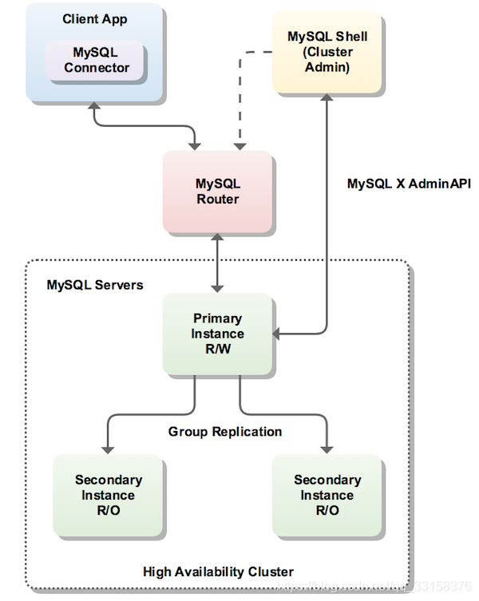
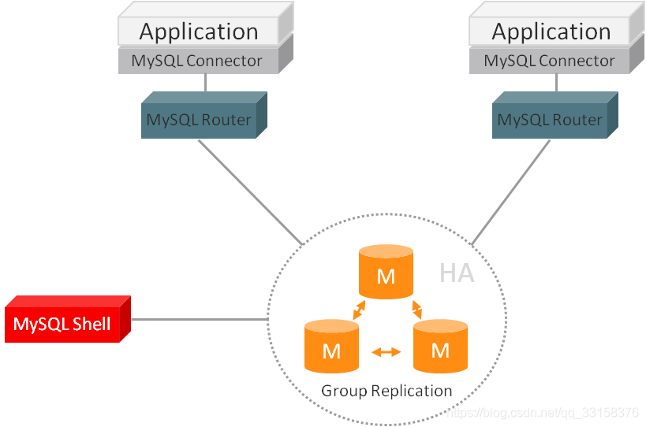

MySQL InnoDB Cluster 为MySQL 提供了完整的高可用性解决方案.通过使用 MySQL Shell 附带的 AdminAPI,您可以轻松地配置和管理一组至少三个 MySQL 服务器实例,以充当 InnoDB 集群.

每个 MySQL 服务器实例都运行MySQL Group Replication,它提供了具有内置故障转移功能的 InnoDB Clusters 中复制数据的机制,消除了直接在 InnoD B群集中使用组复制的需要.

整个集群环境如下:



## 准备环境

server id| IP | 主机名 | 部署应用 | 应用版本
:--- | :--- | :--- | :--- | :---
1 | 10.71.1.31 | mysql-1 | mysql-cluster,mysql-router,mysql-shell | 8.0.21
2 | 10.71.1.32 | mysql-2 | mysql-cluster,mysql-router,mysql-shell | 8.0.21
3 | 10.71.1.33 | mysql-3 | mysql-cluster,mysql-router,mysql-shell | 8.0.21

以上三台设备都下载了 [mysql-cluster](https://dev.mysql.com/downloads/cluster/),[mysql-router](https://downloads.mysql.com/archives/router/),[mysql-shell](https://downloads.mysql.com/archives/shell/) 对应版本的安装包,解压到 `/usr/local/` 对应目录下.

## 安装 MySQL Cluster

### 配置文件

mysql-cluster 配置文件如下.之后需要修改的配置包括

- `server_id`: 集群主机的唯一标识
- `loose-group_replication_local_address`: 集群主机的本地 IP 地址及 replication 的端口
- `report_host`: 集群主机的本地 IP 地址

```conf
# /etc/my.cnf

[client]
port            = 3306
socket          = /usr/local/mysql/tmp/mysql.sock

[mysql]
no-auto-rehash
default-character-set=utf8
socket          = /usr/local/mysql/tmp/mysql.sock

[mysqld]
user                            = mysql
port                            = 3306
server_id                       = 1
basedir                         = /usr/local/mysql
datadir                         = /usr/local/mysql/data/
tmpdir                          = /usr/local/mysql/tmp/
socket                          = /usr/local/mysql/tmp/mysql.sock
slow_query_log                  = ON
slow_query_log_file             = /usr/local/mysql/log/mysql-slow-queries.log
long_query_time                 = 10
log_error                       = /usr/local/mysql/log/error.log
log-bin                         = /usr/local/mysql/binlog/mysql-bin.log
pid-file                        = /usr/local/mysql/tmp/mysql.pid
character-set-server            = utf8
binlog_format                   = ROW
skip_name_resolve               = on
default-storage-engine          = innodb
max_connections                 = 3000
explicit_defaults_for_timestamp = OFF
gtid_mode                       = on
enforce_gtid_consistency=on
log-slave-updates=on

delayed_insert_limit = 1000
delayed_insert_timeout = 3000
delayed_queue_size = 5000

bulk_insert_buffer_size =1024M
concurrent_insert=2
thread_stack =  32M
event_scheduler = ON
lower_case_table_names=1
sort_buffer_size = 600M
net_buffer_length =  1M
read_rnd_buffer_size = 600M
tmp_table_size = 600M
max_heap_table_size = 16M
read_buffer_size= 600M
expire_logs_days = 5

#innodb
sync_binlog=1
innodb_data_file_path = ibdata1:10M:autoextend
innodb_buffer_pool_size = 1024M
innodb_log_file_size = 2047M
innodb_log_buffer_size = 8M
innodb_flush_log_at_trx_commit = 2
innodb_lock_wait_timeout = 50
innodb_rollback_on_timeout = ON
innodb_file_per_table
innodb_flush_method=O_DIRECT
innodb_open_files = 65536
innodb_io_capacity = 1000
innodb_read_io_threads = 8
innodb_write_io_threads  = 1
innodb_spin_wait_delay = 96
innodb_max_dirty_pages_pct = 50
innodb_sync_spin_loops = 30

#MYISAM
key_buffer_size =   1G
myisam_sort_buffer_size = 1G
myisam_repair_threads=2

# innodb cluster
transaction_write_set_extraction=XXHASH64
loose-group_replication_group_name='aaaaaaaa-aaaa-aaaa-aaaa-aaaaaaaaaaaa'
loose-group_replication_start_on_boot=off
loose-group_replication_ip_whitelist='10.71.1.0/24'
loose-group_replication_local_address='10.71.1.31:33061'
loose-group_replication_group_seeds='10.71.1.31:33061,10.71.1.32:33061,10.71.1.33:33061'
loose-group_replication_bootstrap_group=off
loose-group_replication_single_primary_mode=on
loose-group_replication_enforce_update_everywhere_checks=off
loose-group_replication_recovery_get_public_key=on
loose-group_replication_recovery_use_ssl=off
loose-group_replication_ssl_mode='DISABLED'
loose-group_replication_consistency='EVENTUAL'
loose-group_replication_member_expel_timeout=5
report_host='10.71.1.31'
report_port=3306
plugin_load_add ='group_replication.so'
auto_increment_increment=1
auto_increment_offset=1
mysqlx_port=33060
admin_port=33062
```

### 开始安装

#### 添加用户,并授予权限

```bash
tar -xzf mysql-cluster-8.0.21-el7-x86_64.tar.gz -C /usr/local/
cd /usr/local/
ln -s mysql-cluster-8.0.21-el7-x86_64 mysql
mkdir mysql/{data,log,binlog,tmp}

groupadd mysql && useradd -r -g mysql -s /bin/false mysql
chown -R mysql:mysql /usr/local/mysql/

echo 'export PATH=/usr/local/mysql/bin:$PATH' >> /etc/profile.d/mysql.sh
source  /etc/profile.d/mysql.sh
```

#### 初始化数据库

```bash
cd /usr/local/mysql/
bin/mysqld --defaults-file=/etc/my.cnf --user=mysql -I
# 初始化数据库过程中,数据库密码会以随机字符串形式打印到 log/error.log 中
tail log/error.log
# 2021-03-27T01:23:19.648140Z 6 [Note] [MY-010454] [Server] A temporary password is generated for root@localhost: reOq-(AQ!6Mf
```

### 启动数据库并连接后修改密码

```bash
bin/mysqld_safe --defaults-file=/etc/my.cnf --user=mysql

bin/mysql --defaults-file=/etc/my.cnf -u root -h localhost -p # 输入 log.error.lor 中的密码
```

```sql
-- 在所有节点上执行如下语句,修改密码
SET SQL_LOG_BIN=0;
SET global super_read_only=OFF;
SET global read_only=OFF;
ALTER USER USER() IDENTIFIED BY 'root';
flush privileges;
SET SQL_LOG_BIN=1;

-- 在所有节点上创建后续 mysql-router 引导启动时的用户并授权
SET SQL_LOG_BIN=0;
CREATE USER 'root'@'%' IDENTIFIED WITH mysql_native_password BY 'root';
GRANT ALL PRIVILEGES ON *.* TO 'root'@'%' WITH GRANT OPTION;
FLUSH PRIVILEGES;
SET SQL_LOG_BIN=1;
```

这里提供了 mysqld 服务的启动脚本,使用 systemd 管理比较方便

```bash
# /usr/lib/systemd/system/mysqld.service
[Unit]
Description=mysqld service
Documentation=https://dev.mysql.com/doc/

[Service]
ExecStart=/usr/local/mysql/bin/mysqld_safe --defaults-file=/etc/my.cnf --user=mysql

Restart=always
RestartSec=10s

[Install]
WantedBy=multi-user.target
```

#### 确认安装组复制插件(可能已经存在)

```sql
-- 在所有节点上执行如下语句
INSTALL PLUGIN group_replication SONAME 'group_replication.so';
SELECT PLUGIN_NAME, PLUGIN_STATUS FROM INFORMATION_SCHEMA.PLUGINS  WHERE PLUGIN_NAME LIKE '%group_replication%';
```

#### 创建同步用户

```sql
-- 在所有节点上执行如下语句,创建组同步用户
SET SQL_LOG_BIN=0;
CREATE USER IF NOT EXISTS `repl`@`%` IDENTIFIED WITH mysql_native_password BY 'repl';
GRANT REPLICATION SLAVE ON *.* TO repl@'%';
FLUSH PRIVILEGES;
SET SQL_LOG_BIN=1;

SELECT host, user, authentication_string, plugin FROM mysql.user;

SET SQL_LOG_BIN=0;
CHANGE MASTER TO MASTER_USER='repl', MASTER_PASSWORD='repl' FOR CHANNEL 'group_replication_recovery';
SELECT User_name,Channel_name FROM mysql.slave_master_info WHERE user_name = 'repl';
SET global group_replication_recovery_get_public_key=ON;
SET SQL_LOG_BIN=1;
```

### 启动组复制

在此示例中,三个实例用于该组,这是创建组的最小实例数.可以添加更多实例将增加组的容错能力.例如,如果该组由三个成员组成,则在一个实例失败的情况下,该组可以继续.但是,如果发生另一个故障,该组将无法继续处理写事务.通过添加更多实例,在组继续处理事务时可能发生故障的服务器数量也会增加.一个组中最多可以使用 9 个实例。

#### 一些额外配置

对于组复制,数据必须存储在InnoDB事务存储引擎中,使用其他存储引擎(包括临时 MEMORY 存储引擎)可能会导致组复制中的错误.可以设置如下 `disabled_storage_engines` 系统变量以防止其使用:

```conf
# /etc/my.cnf
[mysqld]
# ...
disabled_storage_engines="MyISAM,BLACKHOLE,FEDERATED,ARCHIVE,MEMORY"
```

从 MySQL 8.0.21 开始,组复制支持二进制日志中校验和的存在,并且可以使用它们来验证某些通道上事件的完整性,因此可以使用默认设置.如不使用则可以设置如下:

```conf
# /etc/my.cnf
[mysqld]
# ...
binlog_checksum=NONE
```

#### 引导组

当安装好三个节点后,首次启动组的过程称为引导.您可以使用 `group_replication_bootstrap_group` 系统变量来引导组.**引导程序只能由一台服务器(启动该组的服务器)执行一次,并且只能执行一次.**

- 连接到节点 1 并发出以下语句

```sql
-- 仅在节点 1 上执行如下 SQL 启动引导
SET GLOBAL group_replication_bootstrap_group=ON;
-- START  GROUP_REPLICATION;
-- 从 MySQL 8.0.21 开始,可以为 START GROUP_REPLICATION 语句提供分布式恢复数据的用户凭据
START GROUP_REPLICATION USER='repl', PASSWORD='repl';
SET GLOBAL group_replication_bootstrap_group=OFF;
```

在其他节点执行如下语句,加入组复制

```sql
-- 在节点 上执行如下 SQL 启动引导
START GROUP_REPLICATION;
```

#### 检查组复制状态

```sql
--- 任意一个节点,执行如下语句,检查组复制状态
mysql> SELECT * FROM performance_schema.replication_group_members;
+---------------------------+--------------------------------------+-------------+-------------+--------------+-------------+----------------+
| CHANNEL_NAME              | MEMBER_ID                            | MEMBER_HOST | MEMBER_PORT | MEMBER_STATE | MEMBER_ROLE | MEMBER_VERSION |
+---------------------------+--------------------------------------+-------------+-------------+--------------+-------------+----------------+
| group_replication_applier | 0355f651-8e9b-11eb-93a6-e8611f128e89 | 10.71.1.31  |        3306 | ONLINE       | PRIMARY     | 8.0.21         |
| group_replication_applier | 0356851b-8e9b-11eb-bbe5-e8611f1359d8 | 10.71.1.32  |        3306 | ONLINE       | SECONDARY   | 8.0.21         |
| group_replication_applier | 0414ad46-8e9b-11eb-9faf-305a3a794266 | 10.71.1.33  |        3306 | ONLINE       | SECONDARY   | 8.0.21         |
+---------------------------+--------------------------------------+-------------+-------------+--------------+-------------+----------------+
3 rows in set (0.00 sec)
```

至些,MGR 三节点组复制安装完毕~

### 可能出现的错误及解决

#### Binlog format should be ROW for Group Replication

- 错误信息

```sql
mysql> START GROUP_REPLICATION USER='repl', PASSWORD='repl';
ERROR 3092 (HY000): The server is not configured properly to be an active member of the group. Please see more details on error log.
```

- error.log

```log
2021-03-27T02:19:57.240689Z 16 [ERROR] [MY-011595] [Repl] Plugin group_replication reported: 'Binlog format should be ROW for Group Replication'
```

- 解决

```sql
SET GLOBAL binlog_format=ROW;
```

## 安装 MySQL Shell

MySQL Shell 是 MySQL Server 的高级客户端和代码编辑器.除了提供的类似于 MySQL 的 SQL 功能外,MySQL Shell 还提供 JavaScript 和 Python 脚本功能,并包括与 MySQL 配合使用的 API.X DevAPI 使您能够使用关系数据和文档数据,AdminAPI 使您可以使用 InnoDB Cluster.

MySQL Shell 安装过程非常简单

```bash
tar -xzf mysql-shell-8.0.21-linux-glibc2.12-x86-64bit.tar.gz -C /usr/local/
cd /usr/local/
ln -s mysql-shell-8.0.21-linux-glibc2.12-x86-64bit mysql-shell

chown -R mysql.mysql mysql-shell

echo 'export PATH=/usr/local/mysql-shell/bin:$PATH' >> /etc/profile.d/mysql-shell.sh
source  /etc/profile.d/mysql-shell.sh
```

## 创建 Innodb Cluster 集群

如果您已经有组复制的现有部署,并且想要使用它来创建群集,请将 `adoptFromGR` 参数传递给该 `dba.createCluster()` 函数.创建的 InnoDB 群集匹配复制组是以单主数据库还是多主数据库运行.

要采用现有的组复制组,使用 MySQL Shell 连接到组成员执行以下 SQL:

```bash
mysqlsh -uroot -hlocalhost -p
var cluster = dba.createCluster('testCluster', {adoptFromGR: true});
dba.getCluster("testCluster").status();
```

输出内容如下:

```json
{
    "clusterName": "testCluster",
    "defaultReplicaSet": {
        "name": "default",
        "primary": "10.71.1.31:3306",
        "ssl": "DISABLED",
        "status": "OK",
        "statusText": "Cluster is ONLINE and can tolerate up to ONE failure.",
        "topology": {
            "10.71.1.31:3306": {
                "address": "10.71.1.31:3306",
                "mode": "R/O",
                "readReplicas": {},
                "replicationLag": null,
                "role": "HA",
                "status": "ONLINE",
                "version": "8.0.21"
            },
            "10.71.1.32:3306": {
                "address": "10.71.1.32:3306",
                "mode": "R/O",
                "readReplicas": {},
                "replicationLag": null,
                "role": "HA",
                "status": "ONLINE",
                "version": "8.0.21"
            },
            "10.71.1.33:3306": {
                "address": "10.71.1.33:3306",
                "mode": "R/W",
                "readReplicas": {},
                "replicationLag": null,
                "role": "HA",
                "status": "ONLINE",
                "version": "8.0.21"
            }
        },
        "topologyMode": "Single-Primary"
    },
    "groupInformationSourceMember": "10.71.1.31:3306"
}
```

关键字段如下:

```text
"status": "OK" 表示集群状态是正常的
"topologyMode": "Single-Primary" 表示是单主模式
"mode": "R/W" 表示可读可写
"mode": "R/O" 表示只读
```

## 安装 MySQL Router

MySQL Router 是 InnoDB Cluster 的一部分.是轻量级的中间件,可在应用程序与后端 MySQL 服务器之间提供透明的路由.它可以用于各种用例,例如通过有效地将数据库流量路由到适当的后端MySQL服务器来提供高可用性和可伸缩性.

为了获得最佳性能,MySQL Router 通常与使用它的应用程序安装在同一主机上.可能的原因包括

- 允许本地 UNIX 域套接字连接到应用程序,而不是TCP/IP,减少网络延迟

- 为了允许 MySQL 路由器连接到 MySQL 而不需要路由器主机的额外帐户,对于专门为应用程序主机创建的 MySQL 帐户（例如 myapp@198.51.100.45），而不是像myapp @％这样的值 。

您可以在网络上运行多个 MySQL Router 实例，而无需将MySQL Router隔离到单个计算机上



### 解压安装

```bash
tar -xzf mysql-router-8.0.21-el7-x86_64.tar.gz -C /usr/local/
cd /usr/local/
ln -s mysql-router-8.0.21-el7-x86_64 mysql-router
mkdir mysql-router/data

chown -R mysql.mysql mysql-router

echo 'export PATH=/usr/local/mysql-router/bin:$PATH' >> /etc/profile.d/mysql-router.sh
source  /etc/profile.d/mysql-router.sh
```

### bootstrap 引导并启动

bootstrap 引导,创建一个独立的 MySQL Router 实例

```bash
mysqlrouter --bootstrap 'root'@'10.71.1.31' --directory /usr/local/mysql-router/data --conf-use-sockets --user=mysql --name=mysql_router_13306 --conf-bind-address=10.71.1.31 --account-host="%"
# --directory 选项指定 router 的目录,–-name 指定路由器名称.
```

输出如下,

```text
# Bootstrapping MySQL Router instance at '/usr/local/mysql-router-8.0.21-el7-x86_64/data'...

- Creating account(s) (only those that are needed, if any)
- Verifying account (using it to run SQL queries that would be run by Router)
- Storing account in keyring
- Adjusting permissions of generated files
- Creating configuration /usr/local/mysql-router-8.0.21-el7-x86_64/data/mysqlrouter.conf

# MySQL Router 'mysql_router_13306' configured for the InnoDB Cluster 'testCluster'

After this MySQL Router has been started with the generated configuration

    $ ./mysqlrouter -c /usr/local/mysql-router-8.0.21-el7-x86_64/data/mysqlrouter.conf

the cluster 'testCluster' can be reached by connecting to:

## MySQL Classic protocol

- Read/Write Connections: localhost:6446, /usr/local/mysql-router-8.0.21-el7-x86_64/data/mysql.sock
- Read/Only Connections:  localhost:6447, /usr/local/mysql-router-8.0.21-el7-x86_64/data/mysqlro.sock

## MySQL X protocol

- Read/Write Connections: localhost:64460, /usr/local/mysql-router-8.0.21-el7-x86_64/data/mysqlx.sock
- Read/Only Connections:  localhost:64470, /usr/local/mysql-router-8.0.21-el7-x86_64/data/mysqlxro.sock
```

且在 `/usr/local/mysql-router/data/` 目录下生成了如下文件,其中包含配置文件,配置 key,启动/停止脚本等.

```text
tree /usr/local/mysql-router/data/
/usr/local/mysql-router/data/
├── data
│   ├── keyring
│   └── state.json  # 其中包含集群的 metadata-servers
├── log
│   └── mysqlrouter.log
├── mysqlrouter.conf # 其中包含自动生成的配置信息
├── mysqlrouter.key
├── run
├── start.sh
└── stop.sh
```

### 运行并验证

运行 `/usr/local/mysql-router/data/` 目录下生成的 `start.sh` 启动 mysql-router.

```bash
# /usr/local/mysql-router/data/start.sh
# ps -fe | grep mysql-router
root     2035683       1  0 12:42 pts/1    00:00:00 sudo ROUTER_PID=/usr/local/mysql-router-8.0.21-el7-x86_64/data/mysqlrouter.pid /usr/local/mysql-router-8.0.21-el7-x86_64/bin/mysqlrouter -c /usr/local/mysql-router-8.0.21-el7-x86_64/data/mysqlrouter.conf --user=mysql
mysql    2035684 2035683  1 12:42 pts/1    00:00:01 /usr/local/mysql-router-8.0.21-el7-x86_64/bin/mysqlrouter -c /usr/local/mysql-router-8.0.21-el7-x86_64/data/mysqlrouter.conf --user=mysql
# 查看监听端口
# netstat -tnlp | grep 2035684
tcp        0      0 10.71.1.31:64460        0.0.0.0:*               LISTEN      2035684/mysqlrouter
tcp        0      0 10.71.1.31:6446         0.0.0.0:*               LISTEN      2035684/mysqlrouter
tcp        0      0 10.71.1.31:6447         0.0.0.0:*               LISTEN      2035684/mysqlrouter
tcp        0      0 10.71.1.31:64470        0.0.0.0:*               LISTEN      2035684/mysqlrouter
```

查看配置文件可以知道

```conf
# /usr/local/mysql-router/data/mysqlrouter.conf 片段
[routing:testCluster_rw]
bind_port=6446  # 读写端口,处理读写请求

[routing:testCluster_ro]
bind_port=6447  # 只读端口,处理只读请求
```

对读写端口进行验证,发现请求到主节点

```bash
# mysql -uroot -h10.71.1.31 -proot -e 'show variables like "server_id"' -P 6446
+---------------+-------+
| Variable_name | Value |
+---------------+-------+
| server_id     | 1     |
+---------------+-------+
```

对只读端口进行验证,发现会在两个从节点上轮询

```bash
# mysql -uroot -h10.71.1.31 -proot -e 'show variables like "server_id"' -P 6447
+---------------+-------+
| Variable_name | Value |
+---------------+-------+
| server_id     | 2     |
+---------------+-------+
# mysql -uroot -h10.71.1.31 -proot -e 'show variables like "server_id"' -P 6447
+---------------+-------+
| Variable_name | Value |
+---------------+-------+
| server_id     | 3     |
+---------------+-------+
```

### 可能出现的问题

#### MySQL-Router 引导时提示权限不足

- 错误提示

```sql
Error: Error creating MySQL account for router (GRANTs stage): Error executing MySQL query "GRANT SELECT, EXECUTE ON mysql_innodb_cluster_metadata.* TO 'mysql_router5_ll685grbj15x'@'%'": Access denied for user 'root'@'%' to database 'mysql_innodb_cluster_metadata' (1044)
```

- 解决

```sql
-- 给用户授予对 mysql_innodb_cluster_metadata 授权的权限
GRANT ALL PRIVILEGES ON `mysql_innodb_cluster_metadata`.* TO 'root'@'%' WITH GRANT OPTION;
GRANT ALL PRIVILEGES ON `mysql_innodb_cluster_metadata_bkp`.* TO 'root'@'%' WITH GRANT OPTION;
GRANT ALL PRIVILEGES ON `mysql_innodb_cluster_metadata_previous`.* TO 'root'@'%' WITH GRANT OPTION;
FLUSH PRIVILEGES;
```

## 模拟主节点宕机

我们把 server_id=1 的 MySQL 主节点停止,使用 MySQL-Router 检测,发现读写请求会被转发到备节点上,该备节点被提升为主节点,形成一主一从的结构

```bash
# 在节点 1 上执行
# systemctl stop mysqld
# mysql -uroot -h10.71.1.31 -proot -e 'show variables like "server_id"' -P 6446
+---------------+-------+
| Variable_name | Value |
+---------------+-------+
| server_id     | 2     |
+---------------+-------+
# mysql -uroot -h10.71.1.31 -proot -e 'show variables like "server_id"' -P 6447
+---------------+-------+
| Variable_name | Value |
+---------------+-------+
| server_id     | 3     |
+---------------+-------+
# mysql -uroot -h10.71.1.31 -proot -e 'show variables like "server_id"' -P 6447
+---------------+-------+
| Variable_name | Value |
+---------------+-------+
| server_id     | 3     |
+---------------+-------+
```

此时在读写端口 6446 上创建测试数据库,并在只读端口 6447 上查看.发现创建成功并完成同步.

```bash
# mysql -uroot -h10.71.1.31 -proot -P 6446 -e "CREATE IF NOT EXIST DATABASE test;"
# mysql -uroot -h10.71.1.31 -proot -P 6447 -e 'SHOW DATABASE;'
+-------------------------------+
| Database                      |
+-------------------------------+
| information_schema            |
| mysql                         |
| mysql_innodb_cluster_metadata |
| performance_schema            |
| sys                           |
| test                          |
+-------------------------------+
```

此时恢复 server_id=1 的上的 MySQL 实例,并手动启动同步.发现之前创建的数据库可以同步到本机上的 MySQL 实例.

```bash
# systemctl start mysqld
# mysql -uroot -h10.71.1.31 -proot
mysql> START GROUP_REPLICATION;
mysql> SHOW DATABASES;
+-------------------------------+
| Database                      |
+-------------------------------+
| information_schema            |
| mysql                         |
| mysql_innodb_cluster_metadata |
| performance_schema            |
| sys                           |
| test                          |
+-------------------------------+
```

如上实现了 MySQL 集群的高可用于故障恢复后的数据同步功能.

---

参考

- [MySQL8.0.21 InnoDB Cluster 从零搭建集群方案详细文档](https://blog.csdn.net/qq_33158376/article/details/109799989)
